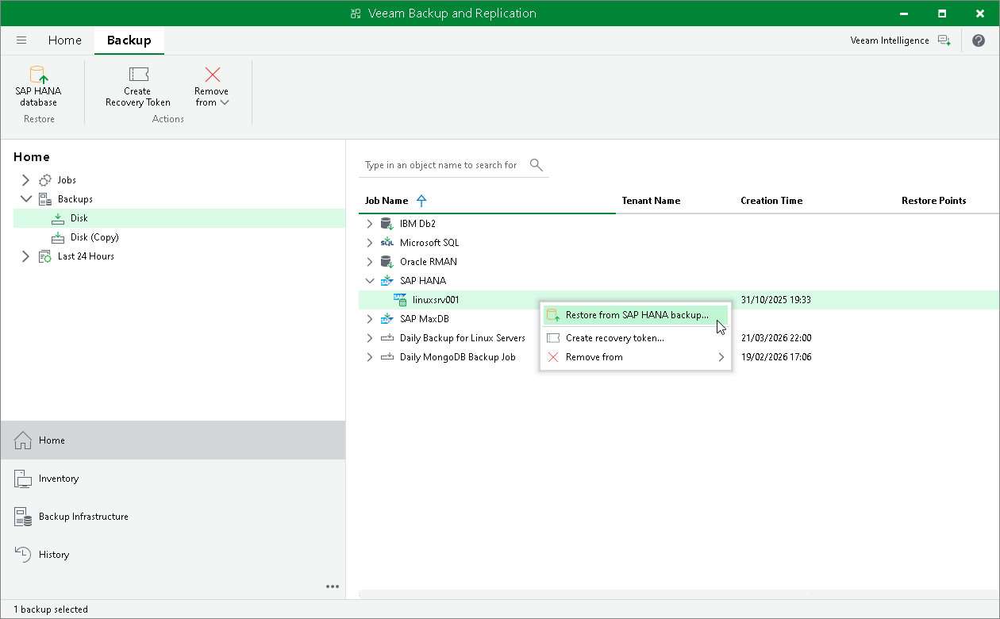

# Restoring from SAP HANA Backup

The SAP HANA backup restore option in Veeam Backup & Replication allows you to recover SAP HANA databases from backups. You can restore databases to the original SAP HANA server or to a new SAP HANA server as needed. To restore SAP HANA databases Veeam Backup & Replication uses Veeam Explorer for SAP HANA.

To restore a database from a SAP HANA backup in Veeam Backup & Replication:

1. Open the Home view.
2. In the inventory pane, click Backups.
3. In the working area, right-click the backup and select Restore from SAP HANA backup.

Clicking the Restore from SAP HANA backup option starts Veeam Explorer for SAP HANA, which allows you to restore the required database. For detailed instructions on restoring databases with Veeam Explorer for SAP HANA, see [Data Restore](vehana_restore.md).

For more information on restore procedures, see [Database Recovery](restoring_databases.md).

