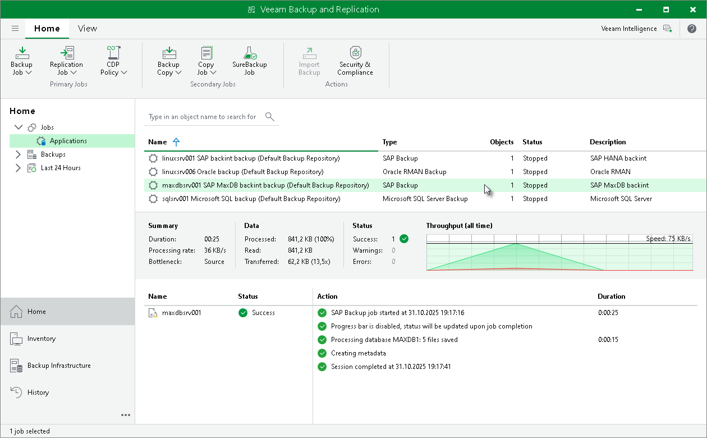
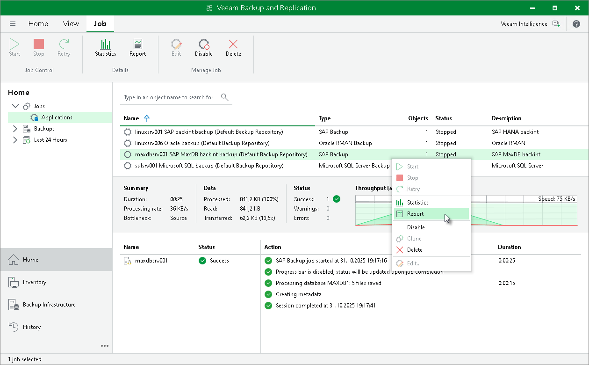
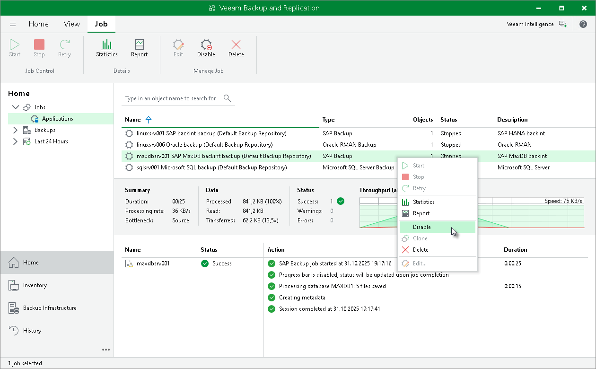
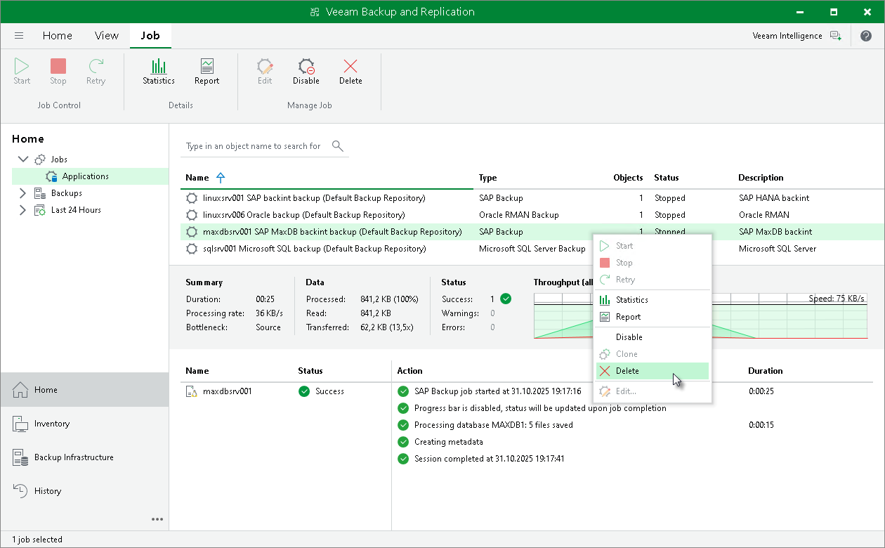

# Backup Job in Veeam Backup & Replication

After Veeam Plug-In for SAP MaxDB starts the backup process, Veeam Backup & Replication creates the backup job. You can use this job to view statistics on the backup process and generate backup job reports. You can also disable or delete the backup job.

Consider the following:

* You cannot start or edit Veeam Plug-In backup jobs in the Veeam Backup & Replication console. You can manage backup operations on the machine with Veeam Plug-In only.
* Veeam Backup & Replication creates one backup job for a machine with Veeam Plug-In for SAP MaxDB. All backup sessions for different databases that reside on this machine run within this backup job.
* Veeam Backup & Replication generates names for SAP MaxDB backup jobs according to the names of the machine with Veeam Plug-In and selected backup repository.

Viewing Backup Job Statistics

To view details of the backup process, do the following:

1. Open the Veeam Backup & Replication console.
2. In the Home view, expand the Jobs node in the inventory pane and click Applications Plug-ins.
3. In the working area, select the Veeam Plug-In backup job to see details of the current backup process or the last backup job session.

Generating Backup Job Reports

Veeam Backup & Replication can generate reports with details about Veeam Plug-In backup job session performance. The session report contains the following session statistics: session duration details, details of the session performance, amount of read, processed and transferred data, backup size, compression ratio, list of warnings and errors (if any).

To generate a report, do the following:

1. Open the Veeam Backup & Replication console.
2. In the Home view, expand the Jobs node in the inventory pane and click Applications Plug-ins.
3. In the working area, select the necessary job and click Report on the ribbon. You can also right-click the job and select Report.

Disabling Backup Job

You can disable Veeam Plug-In backup jobs in the Veeam Backup & Replication console. If you disable the job, you will not be able to run Veeam Plug-In backup commands on the machine with Veeam Plug-In.

To disable a backup job, do the following:

1. Open the Veeam Backup & Replication console.
2. In the Home view, expand the Jobs node in the inventory pane and click Applications Plug-ins.
3. In the working area, select the necessary job and click Disable on the ribbon. You can also right-click the job and select Disable.

Deleting Backup Job

You can delete Veeam Plug-In backup jobs in the Veeam Backup & Replication console. When you delete a job, Veeam Backup & Replication removes all records about the job from its database and console. Veeam Plug-In backups created by this job remain intact on the backup repository. In the Veeam Backup & Replication console, such backups are displayed in the Home view, under the Backups > Disk (Orphaned) node in the inventory pane. In certain cases, the backups can be displayed in other nodes:

* In case of capacity tier, the backups are displayed under the Backups > Capacity Tier (Orphaned) node in the inventory pane.
* In case of object storage, the backups are displayed under the Backups > Object Storage (Orphaned) node in the inventory pane.

Note that if the user starts a new backup job session from the machine with Veeam Plug-In, the job will appear in the Veeam Backup & Replication console again, and records about a new job session will be stored in the Veeam Backup & Replication database.

To delete a backup job, do the following:

1. Open the Veeam Backup & Replication console.
2. In the Home view, expand the Jobs node in the inventory pane and click Applications Plug-ins.
3. In the working area, select the necessary job and click Delete on the ribbon. You can also right-click the job and select Delete.

Page updated 2026-07-28

