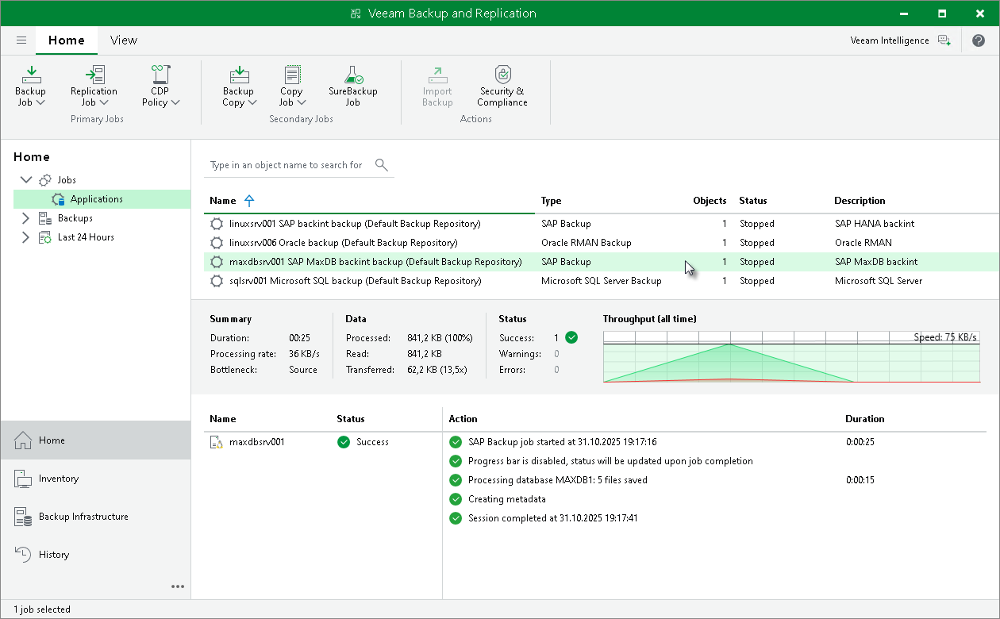

# Viewing Backup Job Statistics

To view details of the backup process, do the following:

1. Open the Veeam Backup & Replication console.
2. In the Home view, expand the Jobs node in the inventory pane and click Applications Plug-ins.
3. In the working area, select the Veeam Plug-In backup job to see details of the current backup process or the last backup job session.

