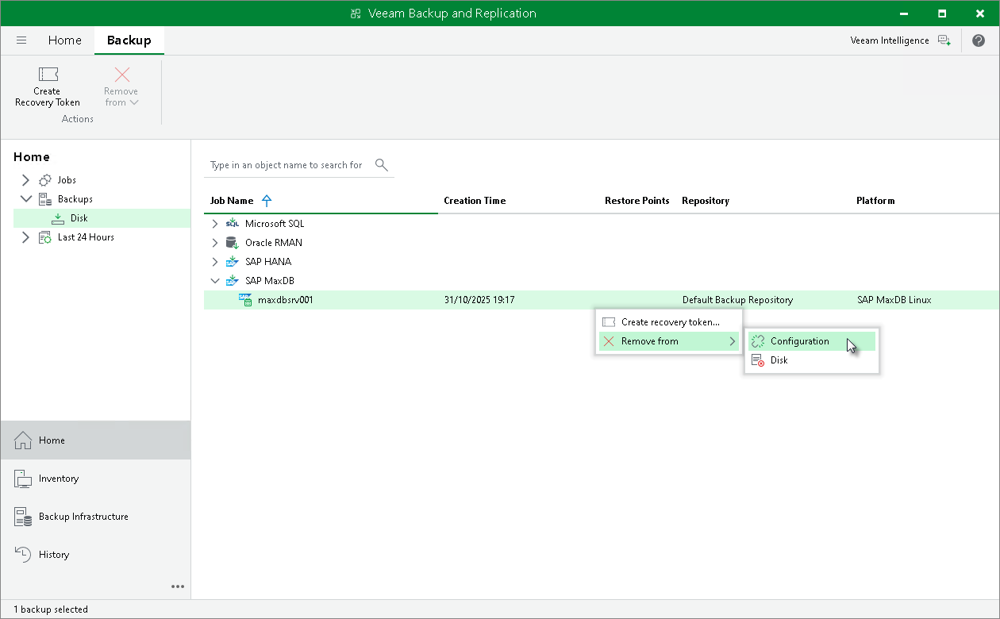

# Removing Backups from Configuration

If you want to remove records about backups from the Veeam Backup & Replication console and configuration database, you can use the Remove from configuration operation.

When you remove a backup from the configuration, backup files (.VAB, .VASM) remain on the backup repository. You can import backup files later and restore from them.

To remove a backup from configuration:

1. Open the Home view.
2. In the inventory pane, select Backups.
3. In the working area, select the necessary backup.
4. Press and hold the [Ctrl] key, right-click the backup and select Remove from configuration.

