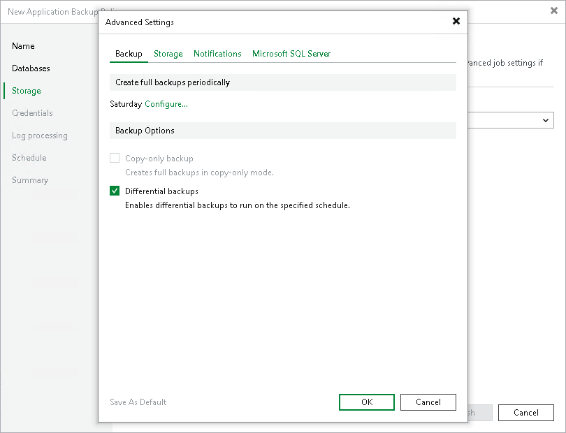

# Backup Settings

In this article

To specify settings for a backup chain created with the backup policy:

1. In the Advanced Settings window, click the Backup tab.
2. To define the schedule for full backups, click Configure and define the schedule in the Schedule Settings window:

* To run the job once a month on specific days, select Monthly on. Use the fields on the right to configure the necessary schedule.
* To run the job once a week on specific week days, select Weekly. Use the fields on the right to select the necessary week days.

1. In the Backup Options, select one of the following modes for incremental backups:

* Copy-only backup. In this mode, Veeam Backup & Replication will create a full backup of data in the database at the time of backup. This backup does not affect the normal backup sequence.
* Differential backup. In this mode, Veeam Backup & Replication will create a backup of data changed since the last incremental data backup.

Page updated 10/31/2025

Page content applies to build 13.0.1.1071
