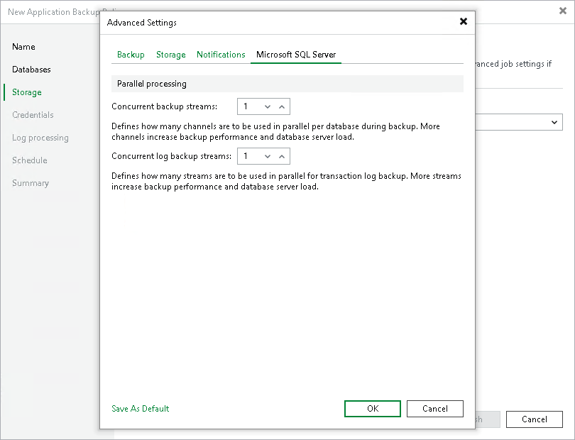

# Microsoft SQL Server

To specify Microsoft SQL Server settings for the backup policy:

1. In the Advanced Settings window, click the Microsoft SQL Server tab.
2. In the Concurrent backup streams field, specify the number of data channels that Veeam Plug-In will use to back up databases in parallel.
3. In the Concurrent log backup streams field, specify the number of data streams that Veeam Plug-In will use to back up transaction logs in parallel.

