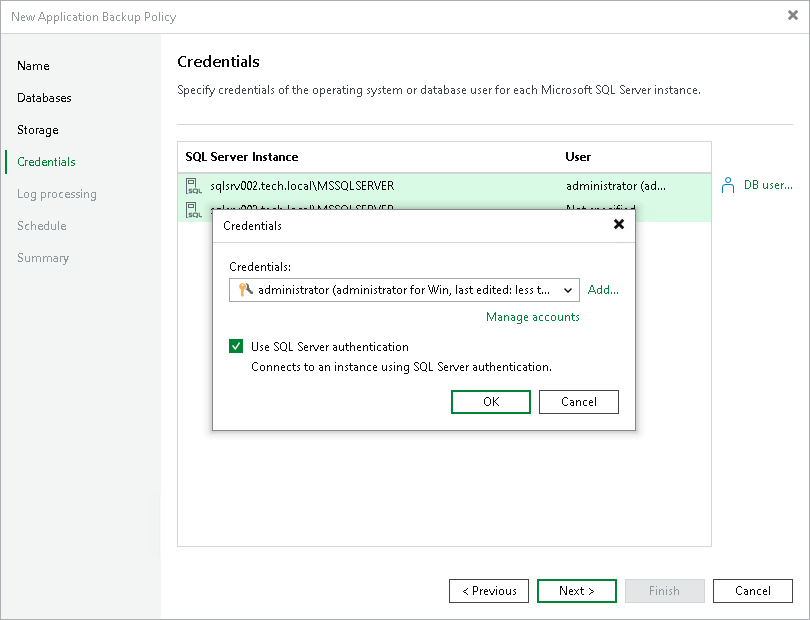

# Step 6. Specify Credentials

At the Credentials step of the wizard, specify credentials that Veeam Plug-In will use to connect to the SQL instance:

1. Select the SQL instance and click DB user.
2. In the Credentials window, select credentials from the list. If you have not set up credentials beforehand, click Add on the right to add credentials.
3. To connect to an SQL instance using a SQL instance user, select the check box Use SQL Server authentication. Otherwise, Veeam Backup & Replication will use the OS user to connect to the SQL instance.

Keep in mind that the specified account must be a SQL instance user with a sysadmin role. For details about required permissions, see [Permissions](plan_and_manage_permissions.md#sql).

