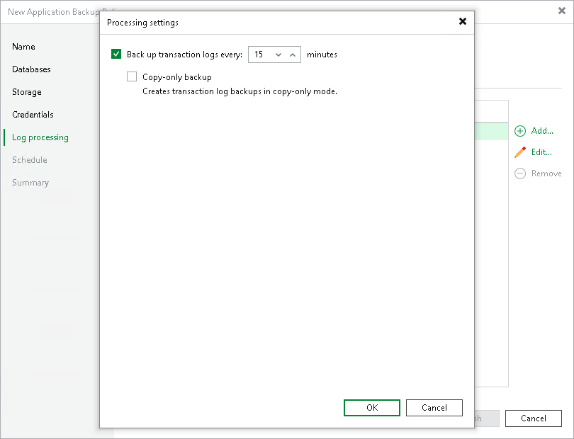

# Processing Settings

To specify processing settings for the object:

1. At the Log Backup step of the wizard, select the object and click Edit.
2. To backup transaction logs, in the Processing settings window, select the Back up transaction logs every check box and specify the frequency for transaction logs backup. By default, transaction logs are backed up every 15 minutes. The maximum log backup interval is 480 minutes.
3. To create transaction log backups in copy-only mode, select the Copy-only backup check box. This backup does not affect the normal backup sequence.

