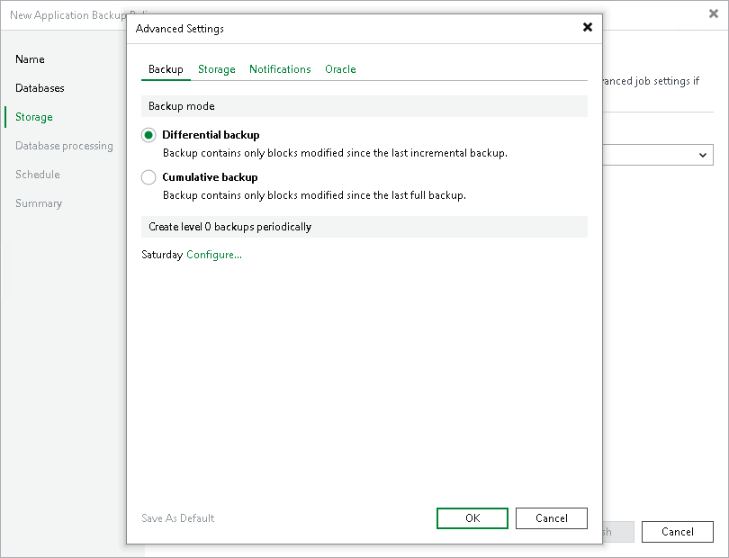

# Backup Settings

In this article

To specify settings for a backup chain created with the backup policy:

1. At the Storage step of the wizard, click Advanced.
2. Click the Backup tab.
3. In the Backup mode, select one of the following modes for incremental backups:

* Differential backup. In this mode, Veeam Backup & Replication will create a backup of data changed since the last incremental data backup.
* Cumulative backup. In this mode, Veeam Backup & Replication will create a backup of data changed since the last full data backup.

1. To define the schedule for full backups, click Configure and define the schedule in the Schedule Settings window:

* To run the full backup once a month on specific days, select Monthly on. Use the fields on the right to configure the necessary schedule.
* To run the full backup once a week on specific week days, select Weekly. Use the fields on the right to select the necessary week days.

Page updated 9/2/2025

Page content applies to build 13.0.1.1071
