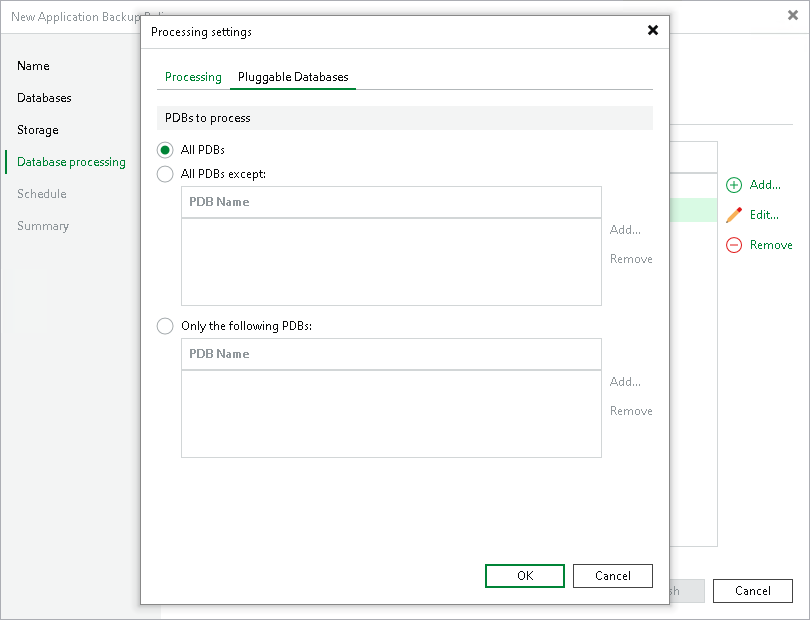

# Pluggable Database Settings

In this article

The Pluggable Databases tab is available if you selected an individual database in the Credentials list at the Database Processing step of the wizard.

To specify settings for pluggable database (PDB) processing:

1. At the Database Processing step of the wizard, select the object in the Credentials list and click Edit.
2. In the Processing tab, set credentials for pluggable databases.
3. In the Processing Settings window, click the Pluggable Databases tab.
4. Select which pluggable databases you want to process:

* All PDBs — select this option if you want to process all detected pluggable databases.
* All PDBs except — select this option if you want to process all detected pluggable databases excluding the databases that you specify. Click Add to add the necessary databases or wildcards to the list.
* Only the following PDBs — select this option if you want to process only those pluggable databases that you specify. Click Add to add the necessary databases or wildcards to the list.

Page updated 9/2/2025

Page content applies to build 13.0.1.1071
