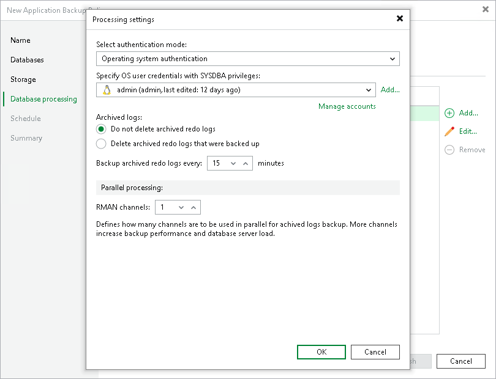
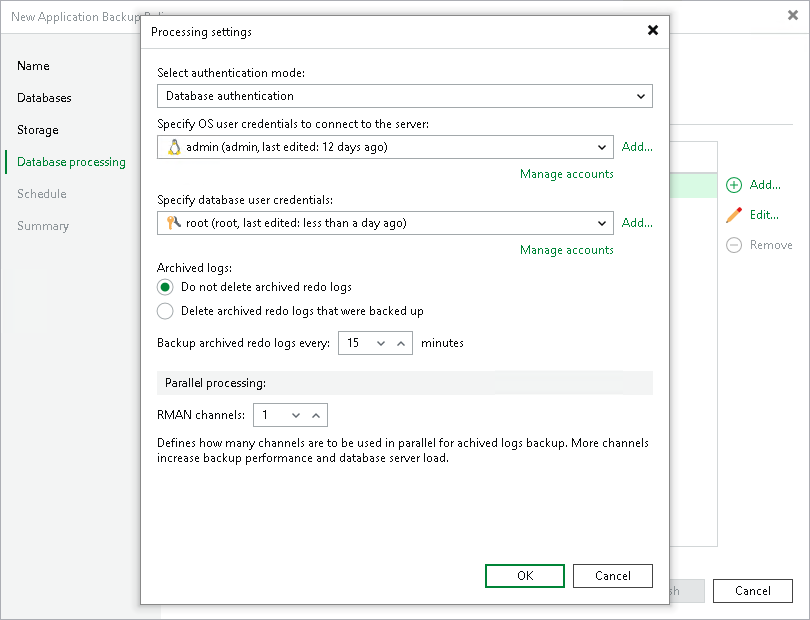

# Processing Settings

To specify processing settings:

1. At the Database Processing step of the wizard, select the object in the Credentials list and click Edit.
2. In the Processing settings window, select the preferred authentication mode from the Select authentication mode list:

* Operating system authentication

With this authentication method, Veeam Backup & Replication uses the OS user credentials to connect to the Oracle server. Then, Veeam Plug-In starts Oracle Recovery Manager (RMAN) using the OS user credentials. After that, RMAN uses the OS user credentials to connect to the Oracle database.

To set the operating system authentication, from the Specify OS user credentials with SYSDBA privileges list, select an OS user account with SYSDBA permissions on the database. The OS user account must be a user on the Oracle server with the required permissions to run RMAN.

If you have not set up credentials beforehand, click the Manage accounts link or click Add on the right to add credentials. For details, see [Credentials Manager](credentials_manager.md).

|  |
| --- |
| Note |
| Make sure the specified OS user account has the required [permissions](plan_and_manage_permissions.md#rman). |

* Database authentication

With this authentication method, Veeam Backup & Replication uses the OS user credentials to connect to the Oracle server. Then, Veeam Plug-In starts RMAN using the OS user credentials. After that, RMAN uses the database user credentials to connect to the Oracle database. This process ensures that the database access is separate from the OS user access rights.

To set the database authentication, do the following:

1. From the Specify OS user credentials to connect to the server list, select an OS user account that Veeam Plug-In will use to connect to the Oracle server. The OS user account must be a user on the Oracle server with the required permissions to run RMAN.
2. From the Specify database user credentials list, select a database user account. The database user account must have the SYSDBA permission on the database. To learn more about Oracle permissions, see [this Oracle article](https://docs.oracle.com/database/121/ADMIN/dba.htm#ADMIN11047).

If you have not set up credentials beforehand, click the Manage accounts link or click Add on the right to add credentials. For details, see [Credentials Manager](credentials_manager.md).

1. In the Archived logs section, specify if Veeam Plug-In must delete archived logs for the Oracle database:

* Select Do not delete archived redo logs if you want Veeam Plug-In to preserve archived logs. When the backup job completes, Veeam Plug-In will not delete archived logs.

Keep in mind that with the ARCHIVELOG mode turned on, archived logs may grow large and consume all disk space. In this case, the database administrator must take care of archived logs him-/herself.

* Select Delete archived redo logs that were backed up if you want Veeam Plug-In back up logs and delete logs from the database after the backup operation. Veeam Plug-In will wait for the backup job to complete successfully and then trigger archived logs truncation using Oracle Call Interface (OCI). If the backup job fails, the logs will remain untouched until the next successful backup job session.

In the Backup archived redo logs every <N> minutes field, specify the frequency for archived logs backup. By default, archived logs are backed up every 15 minutes. The minimum log backup interval is 1 minute. The maximum log backup interval is 480 minutes.

1. In the Parallel processing section, specify the number of data channels that Veeam Plug-In will use in parallel to back up logs.

