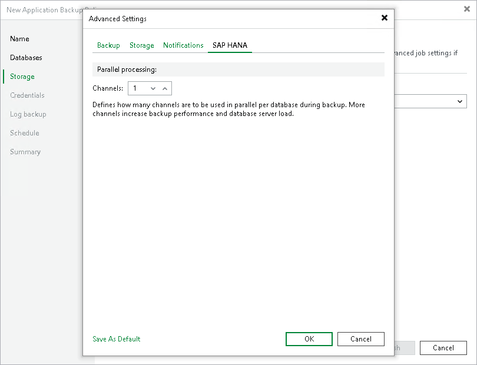

# SAP HANA Settings

To specify SAP HANA settings for the backup policy:

1. At the Storage step of the wizard, click Advanced.
2. Click the SAP HANA tab.
3. In the Channels field, specify the number of data channels that Veeam Plug-In will use in parallel to back up databases.

