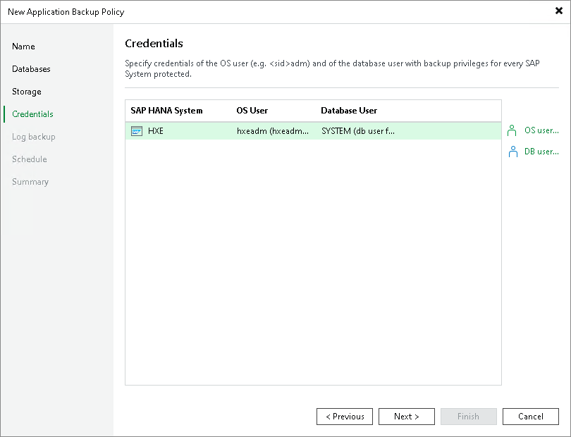

# Step 6. Specify Credentials

In this article

At the Credentials step of the wizard, specify credentials that Veeam Plug-In will use to connect to the database:

1. To specify credentials for the OS user, select the database and click OS user. In the OS user credentials window, select credentials in the list. If you have not set up credentials beforehand, click Add on the right to add credentials.
2. To specify credentials for the database user, select the database and click DB user. In the Database user credentials window, select credentials in the list. If you have not set up credentials beforehand, click Add on the right to add credentials.

|  |
| --- |
| Note |
| Make sure the specified user accounts have the required [permissions](plan_and_manage_permissions.md#hana). |

Page updated 9/2/2025

Page content applies to build 13.0.1.1071
