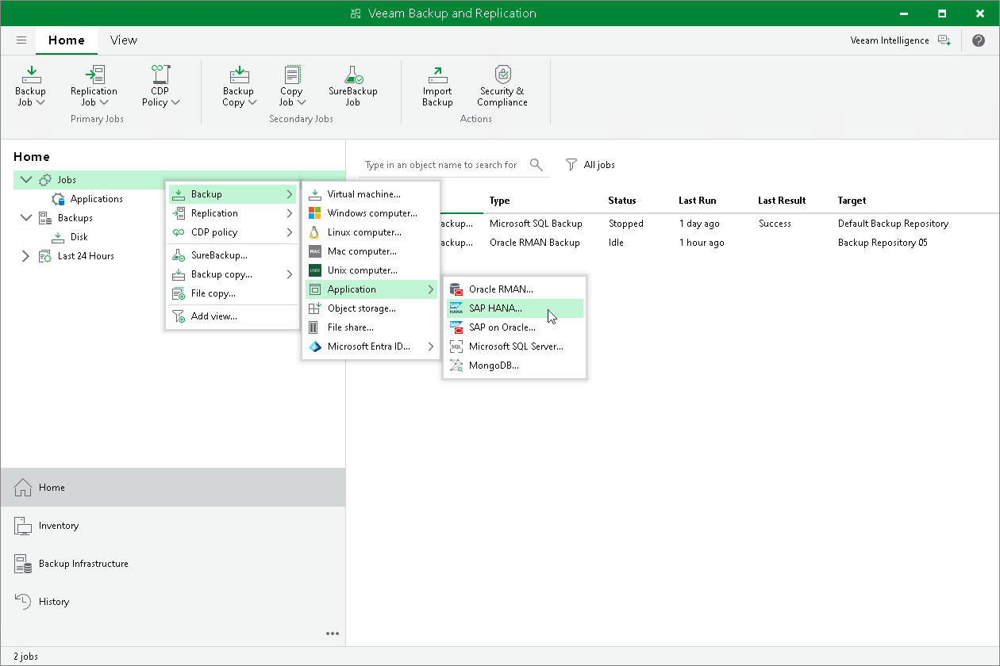

# Step 1. Launch New Application Backup Policy Wizard

In this article

To create an application policy for Veeam Plug-In for SAP HANA, you must launch the New Application Backup Policy wizard. To do this, on the Home tab, click Backup Job > Application > SAP HANA.

Page updated 11/4/2025

Page content applies to build 13.0.1.1071
