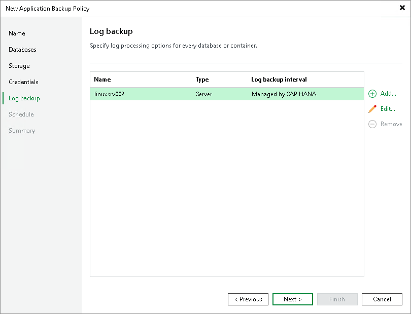

# Step 7. Specify Log Backup Settings

At the Log Backup step of the wizard, specify log processing settings:

1. In the Objects list, select the object and click Edit.
2. Specify log processing settings for the objects in the list. To learn more, see [Processing settings](policy_sap_hana_log_backup_general.md).

In the Objects list, Veeam Backup & Replication shows only those objects that you added to the backup scope at the Databases step of the wizard. If you added a protection group, but need to specify settings for an individual computer or database in this protection group, you can add such objects to the list. To learn more, see [Adding Objects from Backup Scope](#add).

Adding Objects from Backup Scope

To add protection groups, individual computers or databases to the Objects list:

1. Click Add.
2. In the Select Objects window, select one or more objects in the list and click OK. You can select any of the following objects:

* Protection group
* Cluster
* Computer
* SAP system
* SAP database

You can press and hold [Ctrl] to select multiple objects at once.

To quickly find the necessary object, use the search field at the bottom of the Select Objects window.

1. Enter the object name or a part of it in the search field.
2. Click the Start search button on the right or press [Enter].

