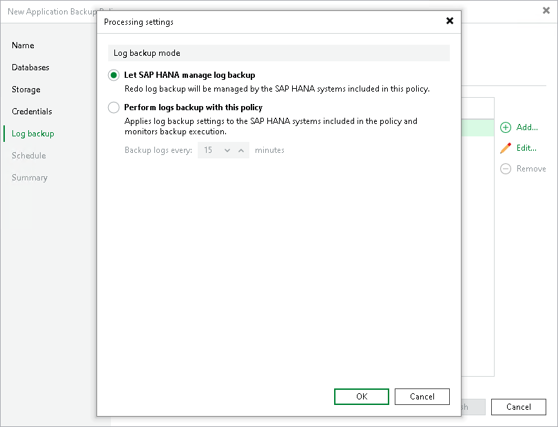

# Processing Settings

To specify processing settings for the object:

1. At the Log Backup step of the wizard, select the object and click Edit.
2. In the Processing tab, select the way you want to back up logs:

* Select Let SAP HANA manage log backup if you want to back up logs with SAP HANA tools.

With SAP HANA tools, you set to back up logs by Veeam Plug-In and set the log backup interval. In this case Veeam Plug-In will backup logs with parameters specified with SAP HANA tools. You can also set SAP HANA tools not to back up logs. In this case Veeam Plug-In will not back up logs too.

* Select Perform log backup with this policy if you want to back up logs with Veeam Plug-In.

In the Backup logs every <N> minutes field, specify the frequency for logs backup. By default, redo logs are backed up every 15 minutes. The minimum log backup interval is 5 minutes. The maximum log backup interval is 480 minutes.

