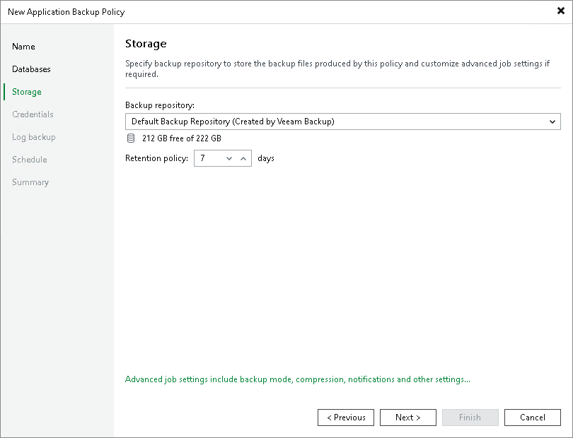

# Step 4. Specify Storage Settings

At the Storage step of the wizard, specify settings for the target backup repository:

1. From the Backup repository list, select a backup repository where you want to store backups. You can select from the Veeam backup repositories configured on the backup server that will manage the created backup policy.
2. In the Retention Policy field, specify the number of days for which you want to store backup files in the target location. By default, Veeam Backup & Replication keeps backup files for 7 days. After this period is over, Veeam Backup & Replication will remove the earliest restore points from the backup chain.
3. Click Advanced to specify advanced settings for the backup job. To learn more, see [Specify Advanced Backup Settings](policy_sap_hana_advanced.md).

