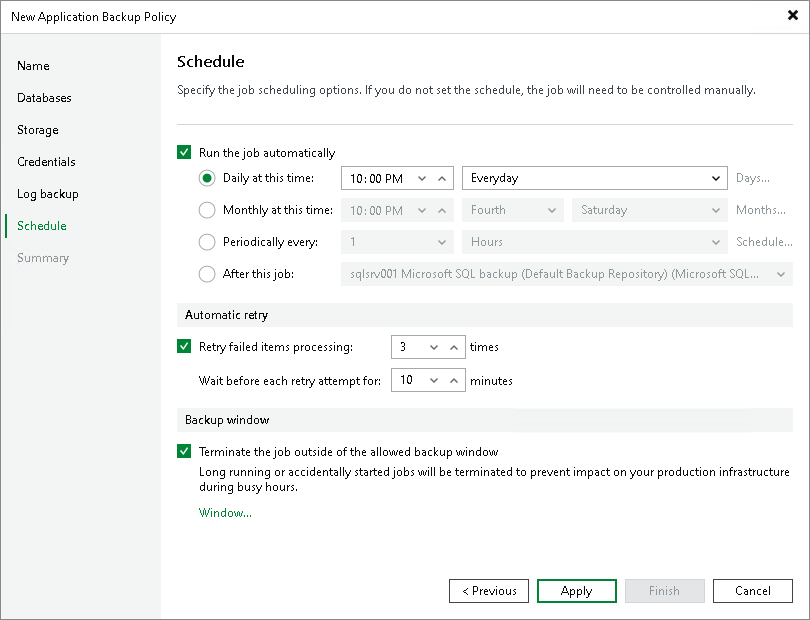

# Step 8. Specify Policy Schedule

At the Schedule step of the wizard, specify the schedule according to which you want to perform backup.

To specify the job schedule:

1. Select the Run the job automatically check box. If this check box is not selected, you will have to start the backup job manually to create backup.
2. Define scheduling settings for the job:

* To run the job at specific time daily, on defined week days or with specific periodicity, select Daily at this time. Use the fields on the right to configure the necessary schedule.
* To run the job once a month on specific days, select Monthly at this time. Use the fields on the right to configure the necessary schedule.
* To run the job repeatedly throughout a day with a specific time interval, select Periodically every. In the field on the right, select the necessary time unit: Hours or Minutes.

* To define the permitted time window for the job, click Schedule and use the time table. In the Start time within an hour field, specify the exact time when the job must start.

A repeatedly run job is started by the following rules:

* The defined interval always starts at 12:00 AM. For example, if you configure to run a job with a 4-hour interval, the job will start at 12:00 AM, 4:00 AM, 8:00 AM, 12:00 PM, 4:00 PM and so on.

* If you define permitted hours for the job, after the denied interval is over, the job will start immediately and then run by the defined schedule.

For example, you have configured a job to run with a 2-hour interval and defined permitted hours from 9:00 AM to 5:00 PM. According to the rules above, the job will first run at 9:00 AM, when the denied period is over. After that, the job will run at 10:00 AM, 12:00 PM, 2:00 PM and 4:00 PM.

* To run the job continuously, select the Periodically every option and choose Continuously from the list on the right. A new backup job session will start as soon as the previous backup job session finishes.
* To chain jobs, use the After this job field. In the common practice, jobs start one after another: when job A finishes, job B starts and so on. If you want to create a chain of jobs, you must define the time schedule for the first job in the chain. For the rest of the jobs in the chain, select the After this job option and choose the preceding job from the list.

|  |
| --- |
| NOTE |
| The After this job option will automatically start a job if the first job in the chain is started automatically by schedule. If you start the first job manually, Veeam Backup & Replication will display a notification. You will be able to choose whether Veeam Backup & Replication must start the chained job as well. |

1. In the Automatic retry section, define whether Veeam Backup & Replication or Veeam Plug-In (depending on the selected job mode) must attempt to run the backup job again if the job fails for some reason. Enter the number of attempts to run the job and define time intervals between them. If you select continuous backup, Veeam Backup & Replication or Veeam Plug-In will retry the job for the defined number of times without any time intervals between the job runs.
2. In the Backup window section, define the time interval within which the backup job must complete. The backup window prevents the job from overlapping with production hours and ensures that the job does not impact performance of your server. To set up a backup window for the job:

1. Select the Terminate job if it exceeds allowed backup window check box and click Window.
2. In the Time Periods window, define the allowed hours and prohibited hours for backup. If the job exceeds the allowed window, it will be automatically terminated.

|  |
| --- |
| NOTE |
| If you configure a backup policy, after you click Apply at the Schedule step of the wizard, Veeam Backup & Replication will immediately apply the backup policy to protected computers. |

