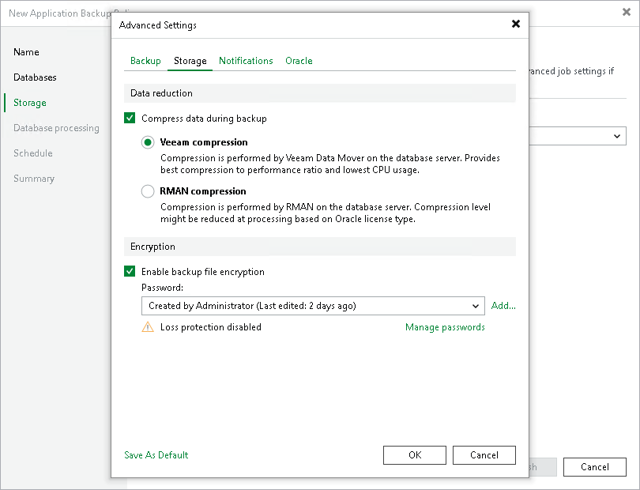

# Storage Settings

To specify compression settings for the backup job:

1. At the Storage step of the wizard, click Advanced.
2. Click the Storage tab.
3. Select the Compress data during backup check box and select the way compression is performed:

* Select Veeam compression if you want to perform data compression with Data Mover by Veeam Software.
* Select RMAN compression if you want to perform data compression with Oracle.

1. To encrypt the content of backup files, select the Enable backup file encryption check box. In the Password field, select a password that you want to use for encryption. If you have not created the password beforehand, click Add or use the Manage passwords link to specify a new password. For more information, see [Password Manager](password_manager.md).

If the backup server is not connected to Veeam Backup Enterprise Manager, you will not be able to restore data from encrypted backups in case you lose the password. Veeam Backup & Replication will display a warning about it. For more information, see [Decrypting Data Without Password](decrypt_without_pass.md).

You can select a Key Management System (KMS) server in the Password field. To do this, the KMS server must be added to Veeam Backup & Replication in advance. If you choose to use KMS keys for backup file encryption at this step of the wizard, Veeam Backup & Replication immediately starts communication with the KMS server to retrieve the encryption keys. To learn more, see [Key Management System Keys](kms.md).

|  |
| --- |
| NOTE |
| Consider the following:   * If you plan to encrypt the content of backup files, consider the limitations listed in [Data Encryption Limitations](#limits). * You must encrypt the backup policy if you want to back up data to the Veeam Data Vault storage. |

Data Encryption Limitations

If you plan to encrypt the content of backup files, consider the following limitations:

* Data encryption settings for application backup policies configured in Veeam Backup & Replication are stored to the Veeam Backup & Replication database.

* If you enable or disable encryption for an existing application backup policy, Veeam Backup & Replication will apply the updated setting during the next job session. Veeam Backup & Replication will also command Veeam Plug-In to store the next created backup into a new backup file.

* Encryption is not retroactive. If you enable encryption for an existing backup policy, Veeam Backup & Replication will encrypt the backup chain starting from the next restore point created with this policy.

To learn more about data encryption in Veeam Backup & Replication, see [Data Encryption](data_encryption.md).

