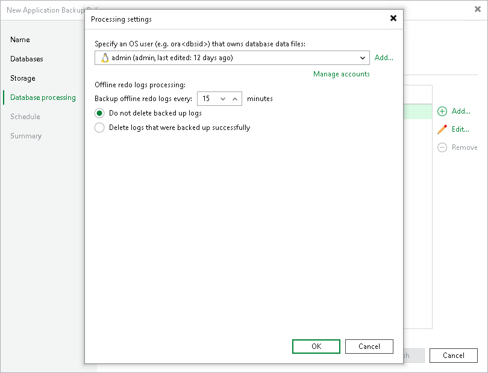

# Processing Settings

To specify processing settings:

1. At the Database Processing step of the wizard, select the object and click Edit.
2. In the Processing Settings window, click the Processing tab.
3. To specify a user account that Veeam Plug-In will use to connect to the Oracle database, select from the Specify OS user (for example, ora<dbsid>) who owns data files of the database list a user account that has SYSDBA rights on the database. If you have not set up credentials beforehand, click the Manage accounts link or click Add on the right to add credentials.
4. In the Backup archived redo logs every <N> minutes field, specify the frequency for archived logs backup. By default, archived logs are backed up every 15 minutes. The minimum log backup interval is 5 minutes. The maximum log backup interval is 480 minutes.
5. Specify if Veeam Plug-In must delete archived logs for the Oracle database:

* Select Do not delete offline redo logs if you want Veeam Plug-In to preserve archived logs. When the backup job completes, Veeam Plug-In will not delete archived logs.

It is recommended that you select this option for databases for which the ARCHIVELOG mode is turned off. If the ARCHIVELOG mode is turned on, archived logs may grow large and consume all disk space. In this case, the database administrator must take care of archived logs him-/herself.

* Select Delete offline redo logs that were backed up if you want Veeam Plug-In back up logs and delete logs from the database after the backup operation. Veeam Plug-In will wait for the backup job to complete successfully and then trigger archived logs truncation using Oracle Call Interface (OCI). If the backup job fails, the logs will remain untouched until the next successful backup job session.

