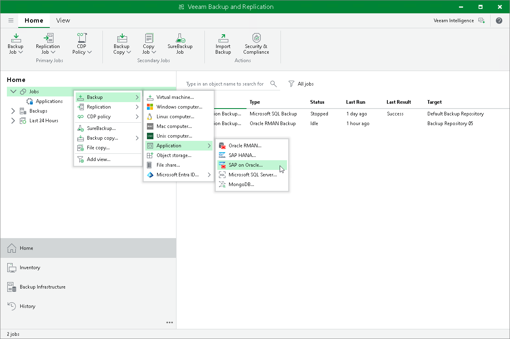

# Step 1. Launch New Application Backup Policy Wizard

To create an application policy for Veeam Plug-In for SAP on Oracle, you must launch the New Application Backup Policy wizard. To do this, on the Home tab, click Backup Job > Application > SAP on Oracle.

