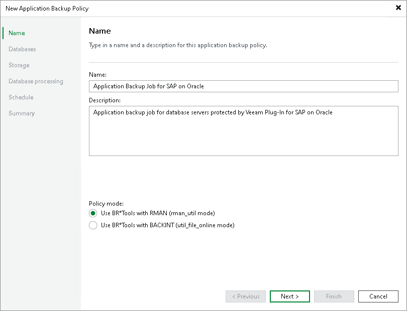

# Step 2. Specify Policy Name

At the Name step of the wizard, specify a name and description for the application backup policy.

1. In the Name field, enter a name for the application backup policy.
2. In the Description field, provide a description for future reference. The default description contains information about the user who created the job, date and time when the job was created.
3. In the Policy mode field, select the job mode. You can select one of the following modes:

* Use BR\*Tools with RMAN (rman\_util mode)

|  |
| --- |
| Note |
| If you plan to back up databases in the rman\_util mode, you must install 2 plug-ins on the Oracle server when you [configure a protection group](protection_group_create.md):   * Veeam Plug-In for Oracle RMAN * Veeam Plug-In for SAP on Oracle |

* Use BR\*Tools with BACKINT (util\_file\_online mode)

