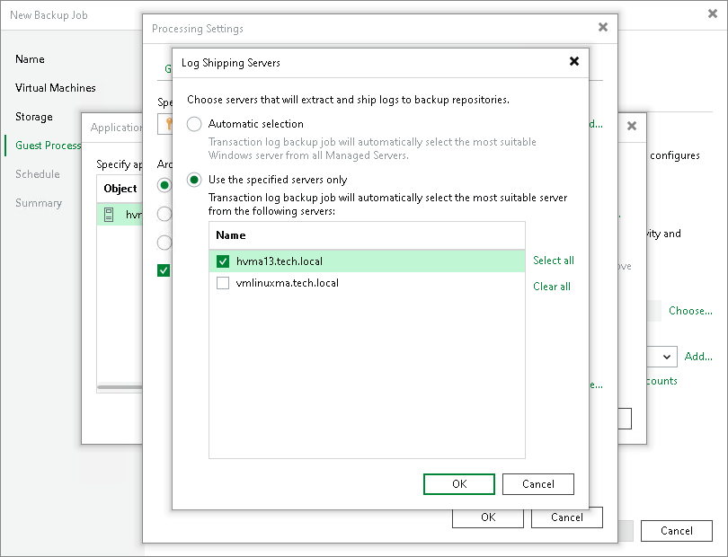

# Log Shipping Servers

In this article

For every PostgreSQL VM whose WAL files you want to back up, Veeam Backup & Replication defines how to ship logs to the backup repository. WAL files can be transported in the following ways:

* Direct connection. If it is possible to establish a direct connection between the VM guest OS and backup repository, WAL files will be shipped directly from the VM guest OS to the backup repository. This method is recommended — it does not involve additional resources and puts less load on the VM guest OS.
* Over log shipping server. If a direct connection is not possible, files will be shipped through log shipping servers. You can configure Veeam Backup & Replication to choose a log shipping server from the list of available ones or to use a specific server. Log shipping servers transfer data over the network. That is why you should check that server are available over the network.

Note that if a direct connection is possible, files will be always transferred from VM guest to repository directly (regardless of the configured log shipping server, as this server will not be involved). This approach helps to optimize performance at file transfer.

A log shipping server is a Microsoft Windows server added to the backup infrastructure. You can explicitly define what servers you want to use for log shipping or instruct Veeam Backup & Replication to automatically choose an optimal log shipping server. Veeam Backup & Replication chooses the log shipping server based on two criteria: possible data transfer methods and location of the PostgreSQL VM and log shipping server. For more information, see [Location of Log Shipping Server and VMs](#location).

Location of Log Shipping Server and VMs

When choosing a log shipping server for the job, Veeam Backup & Replication considers the location of the PostgreSQL VM and log shipping server. Veeam Backup & Replication uses the following priority rules to select the log shipping server:

1. The log shipping server is located on the source Microsoft Hyper-V host performing the role of the on-host backup proxy.
2. The log shipping server and PostgreSQL VM are located in the same network.
3. The log shipping server and PostgreSQL VM are located in different networks (the production infrastructure is isolated from the backup infrastructure).

That is, when choosing a log shipping server, Veeam Backup & Replication will give the top priority to a VM that is located on the source Microsoft Hyper-V host.

Veeam Backup & Replication assigns log shipping servers per job session. When a new job session starts, Veeam Backup & Replication detects a new log shipping server. Veeam Backup & Replication can also re-detect available servers during the job session. If the log shipping server becomes unavailable for some reason, Veeam Backup & Replication will fail over to another log shipping server.

|  |
| --- |
| Important |
| If you do not want to use some servers for WAL files transport, you can manually define what server Veeam Backup & Replication must use as a log shipping server in the job settings. It is recommended that you assign the log shipping server role to a number of servers for availability purposes. |

Page updated 3/3/2025

Page content applies to build 13.0.1.1071
