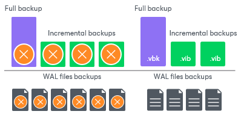
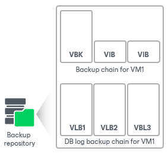

# Retention for Backup Log Backup

Veeam Backup & Replication stores WAL files in the proprietary Veeam format — .VLB and keep them together with the VM image-level backup. For more information on the backup files, see [Backup Chain](backup_files_hv.md).

The target location where Veeam Backup & Replication keeps .VLB files depends on the type of repository where you store VM image-level backup files:

* If it is the backup repository, Veeam Backup & Replication writes WAL files to the same folder where the VM image-level backup files reside.
* If it is the scale-out backup repository, Veeam Backup & Replication writes WAL files to the extent where the latest incremental backup file of the VM image-level backup resides.

Note that Veeam Backup & Replication does not store .VLB files in capacity or archive extents added to the scale-out backup repository.

Veeam Backup & Replication removes WAL files by retention. You can choose one of the following retention methods:

* [Retain WAL files according to the image-level backup](#backup)
* [Retain WAL files for the specified number of days](#days)

Retain Logs with Image-Level Backup

By default, Veeam Backup & Replication retains WAL files together with the image-level backup of a PostgreSQL VM. Veeam Backup & Replication retains VM backup and log backups according to the [short-term retention configured for VM backups](retention_policy_hv.md). When Veeam Backup & Replication removes a restore point of the image-level backup from a backup chain, it also removes a chain of WAL files that relates to this image-level backup.

|  |
| --- |
| Note |
| If you configure long-term retention, Veeam Backup & Replication will retain WAL files according to the short-term retention policy and will delete them after the short-term retention is exceeded. |

This method allows you to have both the image-level backup and necessary WAL files at hand. If you need to recover a PostgreSQL instance to a specific state, you can restore the PostgreSQL VM from the necessary restore point and use WAL files to bring the database to the necessary state.

Retain WAL Files for a Number of Days

You can instruct Veeam Backup & Replication to keep WAL files only for a specific period. You can use this option if you want to save storage space and plan to retain WAL files for the last few days. In this case, you will be able to restore a PostgreSQL instance only to one of the most recent states.

If you select this retention method, you must ensure that retention policies for the image-level backup and archived log backup are consistent. The restore point of the image-level backup must always be preserved. If a backup of the PostgreSQL instance itself is missing, you will not be able to use WAL files for recovery.

WAL Files

At each start of the parent PostgreSQL backup job, Veeam Backup & Replication creates a new .VLB to store log backups in the repository:

* If you select the Use per-machine backup files option for the repository, Veeam Backup & Replication will create a separate .VLB for each server processed by the job.
* If you do not use the Use per-machine backup files option, Veeam Backup & Replication will create a single .VLB for all servers processed by the job.

For example, if a job processes only one PostgreSQL server, the repository will contain a number of .VLB files for it (a so-called chain).

Veeam Backup & Replication comprises native means of the PostgreSQL server to archive WAL files. During the WAL files backup job, the PostgreSQL server stores the files in a temporary folder on the PostgreSQL VM guest file system. After the parent backup job is completed, Veeam Backup & Replication copies WAL files to .VLB and stores them in a backup repository. When a new WAL files job session starts, the PostgreSQL server creates new WAL files and keeps them in the temporary folder. As a result, for a single PostgreSQL VM the job creates a chain of .VLBs that are located in a backup repository together with .VBK and .VIB files. A total number of all WAL files stored in .VLB sets a number of restore points. A single .VLB file can have several WAL files and, therefore, several restore points. For example. 1 .VLB can have 10 restore points.

