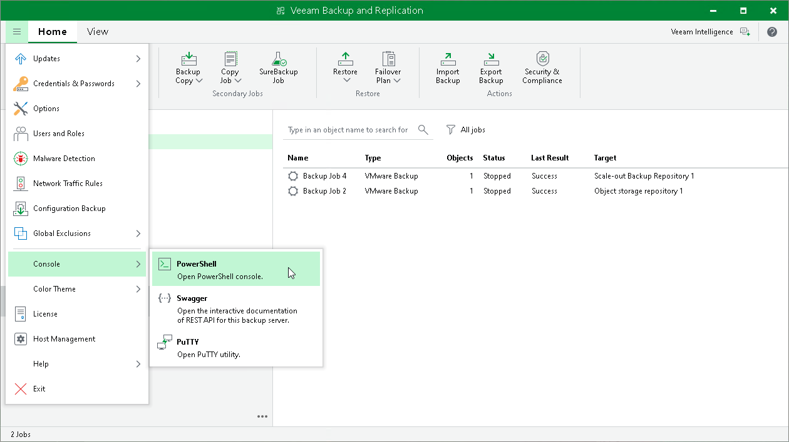

# Running Veeam Backup PowerShell on Windows Machines

Veeam Backup & Replication supports usage of Veeam Backup PowerShell on Windows machines with Veeam Console installed. After you install the Veeam Backup & Replication Console, Veeam PowerShell module will be installed by default. After that, you can run Veeam PowerShell cmdlets from the Veeam Backup & Replication Console, or directly from Windows PowerShell console installed on your machine.

Requirements

Consider the following requirements:

* To run Veeam PowerShell cmdlets, you must have Veeam Backup Administrator role. For more information, see [Users and Roles](https://helpcenter.veeam.com/docs/vbr/userguide/users_roles.html?ver=13).
* A machine that runs the PowerShell session must have Windows PowerShell version 7 installed.
* To utilize the Veeam Explorer PowerShell functionality, you must install the necessary Veeam Explorer PowerShell modules. For more information, see [Starting PowerShell Sessions](https://helpcenter.veeam.com/docs/vbr/explorers_powershell/ps_sessions.html?ver=13) in the Veeam Explorers PowerShell Reference.

Starting Veeam PowerShell Sessions

To run Veeam PowerShell from the Windows machine you must install the Veeam Backup & Replication Console and initiate a PowerShell session.

1. Install the Veeam Backup & Replication Console. For more information on how to install the Veeam Backup & Replication Console, see the [Installing Veeam Backup & Replication Console](https://helpcenter.veeam.com/docs/vbr/userguide/install_console.html?ver=13) section in the User Guide.
2. Start PowerShell Session.

* Starting PowerShell session from the Veeam Backup & Replication UI: in the main menu of Veeam Backup & Replication, select Console > PowerShell.
* Starting PowerShell session from the Windows PowerShell console: start the console on your machine. For more information on starting the console, see [Microsoft Docs](https://docs.microsoft.com/en-us/powershell/scripting/windows-powershell/starting-windows-powershell?view=powershell-7.1).

1. Connect to the backup server.

|  |
| --- |
| Connect-VBRServer -Server "192.24.125.135" -User "TECH\Administrator" -Password "Password" |

After start the Veeam PowerShell session, you must connect to a local or a remote Veeam backup server. For more information on how to connect to a Veeam backup server, see [Connecting to Veeam Backup Server](connect_to_veeam_backup_server.md).

|  |
| --- |
| Tip |
| To verify that Veeam PowerShell module is installed on your machine, run the Get-Module -Name Veeam.Backup.PowerShell -ListAvailable command. The cmdlet will return information on this module. |

