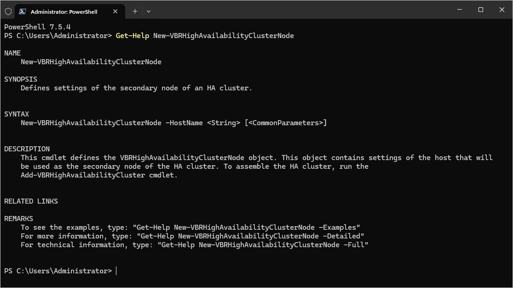

# Using Get-Help

The Get-Help cmdlet is a Microsoft cmdlet that works for Veeam PowerShell module as well. Get-Help <cmdletname> displays a full description of the specified cmdlet along with its syntax and full parameter description.

