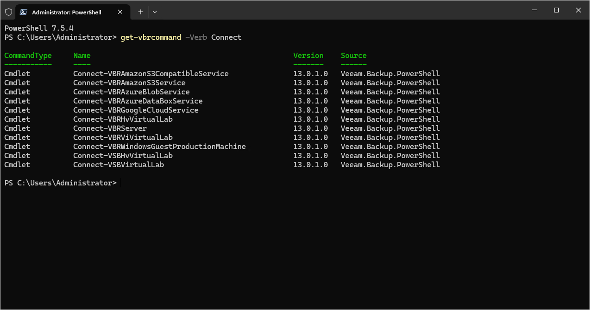

# Using Get-VBRCommand

In this article

The [Get-VBRCommand](get-vbrcommand.md) cmdlet returns the list of cmdlets available in the Veeam PowerShell module.

You can additionally filter the list of commands using the Name, Noun or Verb parameters:

Page updated 6/3/2024

Page content applies to build 13.0.1.1071
