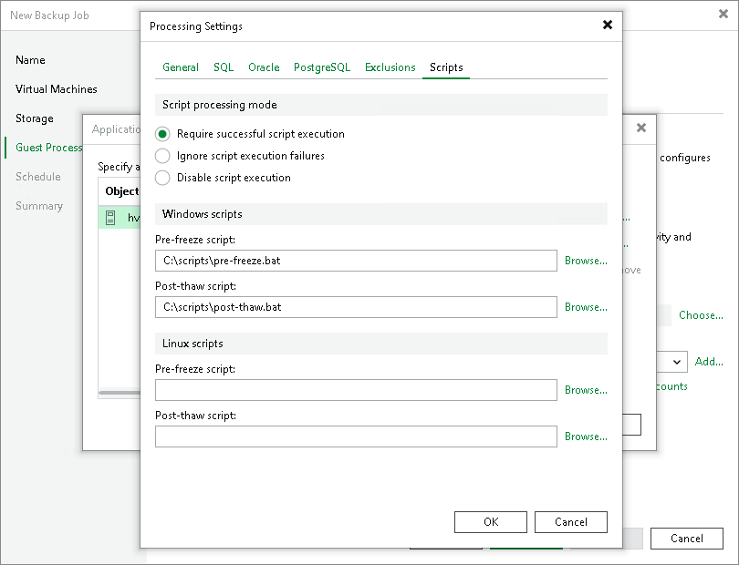

# Pre-Freeze and Post-Thaw Scripts

In this article

If you back up or replicate VMs running applications that do not support Microsoft VSS, you can instruct Veeam Backup & Replication to run custom scripts for VMs. For example, the pre-freeze script may quiesce the file system and application data on the VM guest OS to bring the VM to a consistent state before Veeam Backup & Replication triggers a VM checkpoint. After the checkpoint is created, the post-thaw script may bring the VM and applications to their initial state.

You can use pre-freeze and post-thaw scripts for the following types of jobs:

* Backup job
* Replication job

Scripts must be created beforehand. You must specify paths to them in the job settings. Script execution settings can be configured per VM or per container, depending on the objects included in the job.

When the job starts, Veeam Backup & Replication uploads scripts to the VM guest OS and executes them under the account specified in the Guest OS credentials section of the job settings.

* Scripts for Microsoft Windows VMs are uploaded to \\<vmname>\admin$ over the network. Scripts are executed from the C:\Windows directory. If the network connection fails, PowerShell Direct is used. Scripts are uploaded to \\<hostname>\ADMIN$\<tempdir> and executed from the C:\Windows\<tempdir> directory on the host.

PowerShell Direct is used for VMs that reside on Microsoft Hyper-V Server 2016 (or later) and run Microsoft Windows 10 (or later) or Microsoft Windows Server 2016 (or later). Veeam Backup & Replication requires Microsoft PowerShell 2.0 (or later) to work over PowerShell Direct.

* Scripts for Linux VMs are uploaded over SSH. Scripts are executed from the /tmp directory. If you use Renci or Rebex SSH library, and the [Elevate account privileges automatically](credentials_manager_linux_console.md) check box is selected for the user that you have specified in Guest OS credentials, the scripts will first be uploaded to the /home/<username> and then moved to /tmp.

The script is considered to be executed successfully if "0" is returned.

The default time period for script execution is 10 minutes. If the script fails to execute before the timeout expires, Veeam Backup & Replication displays an error message in the job session and error or warning messages issued during script execution.

Supported Script Formats

Pre-freeze and post-thaw scripts can be used for Microsoft Windows and Linux VMs.

* For Microsoft Windows VMs, Veeam Backup & Replication supports scripts in the EXE, BAT, CMD, WSF, JS, VBS and PS1 file format.
* For Linux VMs, Veeam Backup & Replication supports scripts in the SH file format.

Limitations for Pre-Freeze and Post-Thaw Scripts

Veeam Backup & Replication has the following limitations for pre-freeze and post-thaw scripts:

* You cannot stop a job when the pre-freeze or post-thaw script is executed. If the script hangs up, Veeam Backup & Replication waits for 10 minutes and terminates the job.
* If you want to run several scripts that depend on each other, you must upload them to the VM guest OS manually. For example, you have script1.bat that sequentially starts script2.bat, script3.bat and script4.bat. In this case, you must specify a path to script1.bat in the job properties and upload script2.bat, script3.bat and script4.bat to the VM guest OS.
* You must not use the standard error (STDERR) stream for error output in Linux scripts. Scripts with STDERR cause failures in Veeam Backup & Replication.

Related Topics

* [Creating Backup Jobs](backup_job_hv.md)
* [Creating Replication Jobs](replica_job_hv.md)

Page updated 7/31/2025

Page content applies to build 13.0.1.1071
