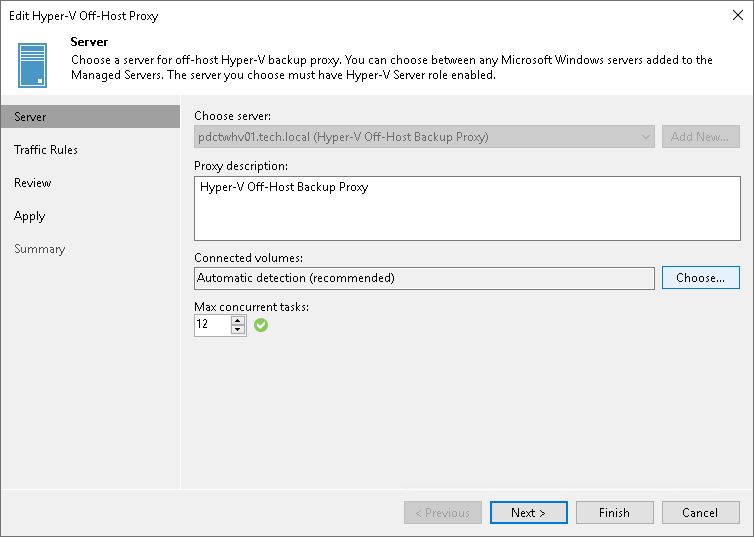

# Presenting Volumes to Off-Host Backup Proxies

In this article

To present volumes to an off-host backup proxy:

1. Open the Backup Infrastructure view.
2. In the [inventory pane](vbr_ui.md), select the Backup Proxies node.
3. In the working area, select the off-host backup proxy and click Edit Proxy on the ribbon or right-click the off-host backup proxy and select Properties.
4. At the Server step of the wizard, click Choose next to the Connected volumes field.

1. In the Connected Volumes window, choose Manual selection and click Populate. Veeam Backup & Replication will display a list of volumes accessible by the off-host backup proxy.
2. If the off-host backup proxy has access to a volume but the volume is not in the list, you can add it manually. To do that, click Add and select the necessary volume.

Page updated 12/21/2023

Page content applies to build 13.0.1.1071
