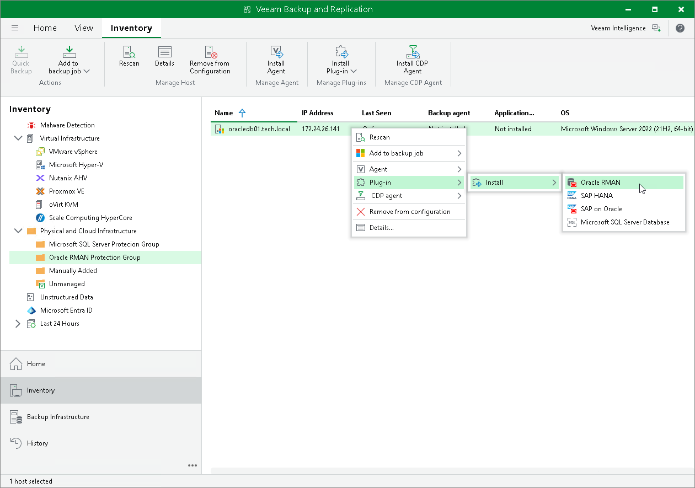

# Installing Veeam Plug-In

You can install Veeam Plug-In on a specific protected computer in the inventory. This operation may be required, for example, if you want to test the installation process before allowing Veeam Backup & Replication to deploy Veeam Plug-In to all computers included in the protection group.

Before you install Veeam Plug-In, check the following prerequisites:

* The protected computer must be powered on and able to be connected over the network.

* The required version of Veeam Plug-In must be available on the distribution server.

To install Veeam Plug-In on a protected computer:

1. Open the Inventory view.
2. In the inventory pane, expand the Physical Infrastructure node and select the necessary protection group.
3. In the working area, select the necessary computer and click Install Plug-In on the ribbon or right-click the computer and select Plug-In > Install and select the plug-in you want to install.

