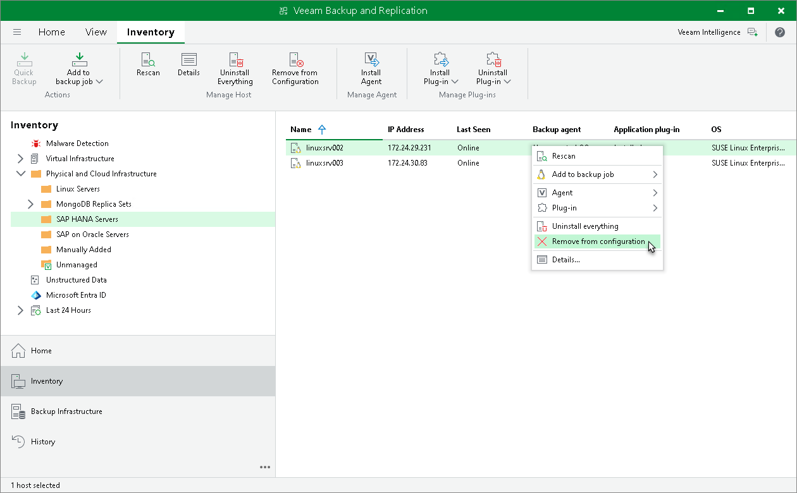

# Removing Computer from Protection Group

You can remove one or more computers from a protection group, for example, if you do not want to protect these computers with Veeam Plug-In any longer but want to back up data of other computers in the protection group.

When you remove a computer from a protection group, Veeam Backup & Replication removes records about the computer from the Veeam backup console and configuration database but does not uninstall Veeam Plug-In from the computer. You can remove Veeam Plug-In from the computer in advance, before you remove the computer from the protection group. To learn more, see [Uninstalling Plug-In](protected_computers_uninstall.md).

Alternatively, you can remove a computer from a protection group, and then uninstall Veeam Plug-In from this computer side. Keep in mind that in this case you will have to uninstall Veeam Plug-In using the built-in tools directly on this computer (for example, Microsoft Windows Control Panel on the Microsoft Windows computer).

|  |
| --- |
| TIP |
| You can also remove entire protection groups from the Veeam Backup & Replication inventory. When you remove a protection group, you can instruct Veeam Backup & Replication to uninstall Veeam Plug-Ins from all protected computers included in this protection group. To learn more, see [Removing Protection Group](protection_group_remove.md). |

To remove a computer from a protection group:

1. Open the Inventory view.
2. In the inventory pane, expand the Physical Infrastructure node and select the necessary protection group.
3. In the working area, select the necessary computer and click Remove from configuration on the ribbon or right-click the computer and select Remove from configuration.

Backups created for computers that were removed from a protection group remain intact in the backup location. You can delete this backup data manually later if needed.

|  |
| --- |
| NOTE |
| You cannot remove a computer from the protection group if this computer is a failover cluster node. |

Alternative Ways to Remove Computer from Protection Group

There are alternative ways to remove computer from protection group that may be suitable for specific situations. Alternative ways of removing computer from protection group differ depending on the type of the protection group that contains the computer you want to remove.

* For a protection group that contains individual computers, edit the protection group and remove the necessary computer at the Computers step of the Edit Protection Group wizard. To learn more, see [Editing Protection Group Settings](protection_group_edit.md).
* For a protection group that contains Active Directory objects, edit the protection group and remove the necessary computer account at the Active Directory step of the Edit Protection Group wizard.

Alternatively, if the protection group contains a container, organization unit, group or entire domain, you can exclude the computer at the Exclusions step of the wizard. To learn more, see [Exclude Objects from Protection Group](protection_group_exclusions_ad.md).

* For a protection group that contains computers listed in a CSV file, remove the record about the necessary computer from the CSV file. During subsequent rescan of the protection group, Veeam Backup & Replication will remove the computer from the protection group.

