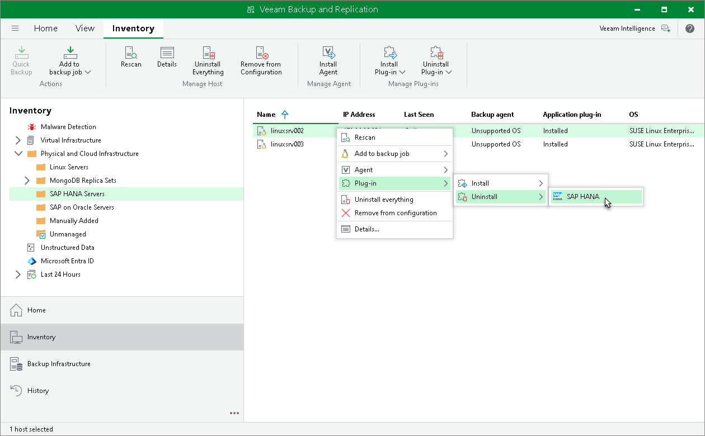

# Uninstalling Veeam Plug-In

You can remove Veeam Plug-In from a specific protected computer, for example, if you want to reinstall Veeam Plug-In running on the protected computer.

To uninstall Veeam Plug-In:

1. Open the Inventory view.
2. In the inventory pane, expand the Physical Infrastructure node and select the necessary protection group.
3. In the working area, select the necessary computer and click Uninstall Plug-In on the ribbon or right-click the computer and select Plug-In > Uninstall and select Veeam Plug-In you want to uninstall.
4. In the displayed notification window, click Yes.

|  |
| --- |
| NOTE |
| Consider the following:   * If automatic installation of Veeam Plug-In is enabled in the protection group settings, after you remove Veeam Plug-In from a selected computer, Veeam Backup & Replication will install Veeam Plug-In on this computer during the next rescan job session started by schedule. * Prerequisite components installed and used by Veeam Plug-In are not removed during the uninstall process. To remove the remaining components, use the built-in tools directly on this computer (for example, Microsoft Windows Control Panel on the Microsoft Windows computer). |

