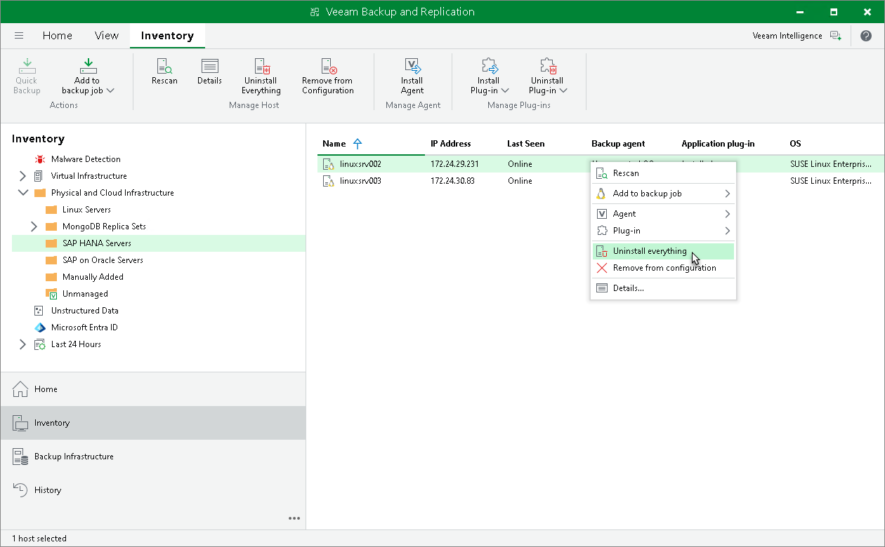

# Uninstalling Veeam Plug-In and Other Veeam Components

You can uninstall all Veeam Plug-Ins and the following Veeam product components installed on a protected computer as one operation:

* The veeam-openssl package
* Veeam Agents
* [For Microsoft Windows computers] Veeam Installer Service
* [For Linux computers] Veeam Deployer Service
* Veeam Transport Service

This approach is helpful if Veeam Plug-Ins are installed on the protected computer, and you do not want to uninstall all products and product components individually.

|  |
| --- |
| Tip |
| * To learn about Veeam Agents, see [Veeam Agent Backup](protect_comp.md). * For details on Veeam Installer Service, Veeam Deployer Service and Veeam Transport Service, see [Veeam Plug-In Management Infrastructure](management_infrastructure.md#agent). |

Before you start the uninstall process, consider the following:

* Veeam Installer Service, Veeam Deployer Service and Veeam Transport Service are not removed from the computer with Veeam Plug-In if the computer is added to the Veeam backup infrastructure as a managed server. For details, see [Virtualization Servers and Hosts](setup_add_server.md).
* [For Linux computers] Veeam Deployer Service is not removed if Veeam Backup & Replication connects to the protected computer with single-use credentials.
* If automatic installation of Veeam Plug-In is enabled in the protection group settings, after you remove Veeam Plug-In from a selected computer, Veeam Backup & Replication will install Veeam Plug-In on this computer during the next rescan job session started by schedule. For details, see [Creating Protection Groups](protection_group_create.md).

|  |
| --- |
| Note |
| If automatic installation of Veeam Plug-In is not enabled in the protection group settings, Veeam Backup & Replication will not install Veeam Plug-In during the next rescan job session started by schedule but will install the Veeam Installer Service or Veeam Deployer Service and Veeam Transport Service on the computer. |

* Prerequisite components installed and used by Veeam Plug-In are not removed during the uninstall process. To remove the remaining components, use the built-in tools directly on this computer (for example, Microsoft Windows Control Panel on the Microsoft Windows computer).

To uninstall Veeam Plug-Ins, Veeam Agents and Veeam product components:

1. Open the Inventory view.
2. In the inventory pane, expand the Physical Infrastructure node and select the necessary protection group.
3. In the working area, select the necessary computer and click Uninstall Everything on the ribbon or right-click the computer and select Uninstall everything.
4. In the displayed notification window, click Yes.

