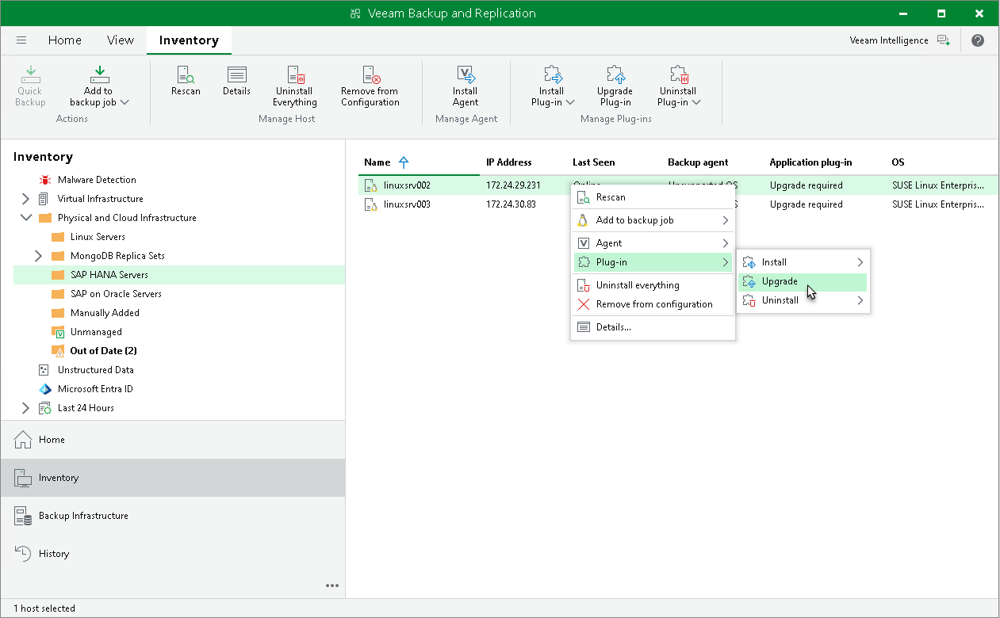
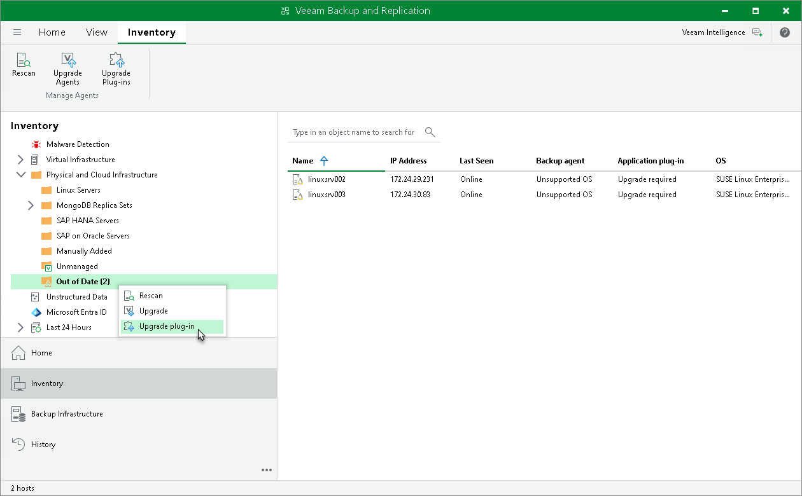

# Upgrading Veeam Plug-In

Periodically, Veeam releases a new version of Veeam Backup & Replication that contains new features and bug fixes. The release package also contains a new version of Veeam Plug-Ins.

Veeam Backup & Replication 13 supports different versions of Veeam Plug-In depending on which OS is running on the backup server:

* Veeam Backup & Replication on Linux supports management of Veeam Plug-Ins 13. Management of previous versions of Veeam Plug-Ins is not supported.
* Veeam Backup & Replication on Microsoft Windows supports management of Veeam Plug-Ins 12.3.2.4165 and later.

Note that Veeam Backup & Replication must be the same or later than the version of Veeam Plug-In. If you want to use the latest functionality, you must upgrade both Veeam Backup & Replication and Veeam Plug-In to the latest version. If you use an earlier Veeam Plug-In build, it may not have all the features and bug fixes introduced in your Veeam Backup & Replication version. To learn more about the Veeam Plug-In builds included in Veeam Backup & Replication installation ISO files, see [this Veeam KB article](https://www.veeam.com/kb4474).

You can upgrade Veeam Plug-In running on a specific protected computer. This operation may be required, for example, if you did not allow Veeam Backup & Replication to automatically upgrade Veeam Plug-In on computers included in the protection group and want to test the upgrade process on a selected computer first.

Before you upgrade Veeam Plug-In, check the following prerequisites:

* The protected computer must be powered on and able to be connected over the network.
* Veeam Plug-In on the protected computer must be managed by Veeam Backup & Replication. Upgrade of standalone Veeam Plug-Ins must be performed from the Veeam Plug-In side. To learn more, see [Upgrading from Veeam Plug-In Side](#from_plug-in).
* The required version of Veeam Plug-In must be available on the distribution server.
* There are no running jobs.

We recommend that you do not stop running jobs and let them complete successfully. Disable any periodic jobs temporarily to prevent them from starting during the upgrade.

|  |
| --- |
| TIP |
| During the protected computers discovery process, Veeam Backup & Replication checks the version of Veeam Plug-In running on a protected computer and the version of Veeam Plug-In available on the distribution server. If a newer version of Veeam Plug-In becomes available on the distribution server, and automatic upgrade of Veeam Plug-In is disabled for a protection group, Veeam Backup & Replication puts a computer to the Upgrade required state.  In addition, Veeam Backup & Replication includes computers that require upgrade of Veeam Plug-In in the Out of Date protection group. You can upgrade Veeam Plug-In on all computers that require upgrade at once. To learn more, see [Upgrading Veeam Plug-In on Multiple Computers](#multiple). |

To upgrade Veeam Plug-In on a protected computer:

1. Open the Inventory view.
2. In the inventory pane, expand the Physical Infrastructure node and select the necessary protection group.
3. In the working area, select the necessary computer and click Upgrade Plug-In on the ribbon or right-click the computer and select Plug-In > Upgrade.

|  |
| --- |
| NOTE |
| In some cases, upgrade to the new version of Veeam Plug-In may require computer reboot. |

Upgrading Veeam Plug-In on Multiple Computers

You can upgrade Veeam Plug-In on all computers that require upgrade at once. To upgrade Veeam Plug-In on protected computers:

1. Open the Inventory view.
2. In the inventory pane, in the Physical Infrastructure node, select the Out of Date protection group and click Upgrade on the ribbon or right-click the Out of Date protection group and select Upgrade.

|  |
| --- |
| NOTE |
| In some cases, upgrade to the new version of Veeam Plug-In may require computer reboot. |

Upgrading from Veeam Plug-In Side

You can also upgrade Veeam Plug-In from the computer side. This approach is required, for example, for standalone Veeam Plug-Ins that are cannot be upgraded from the Veeam backup console. The process of upgrading differs depending on the Veeam Plug-In:

* [Upgrading Veeam Plug-In for Oracle RMAN](update_rman_plugin.md)
* [Upgrading Plug-In for SAP HANA](update_saphana_plugin.md)
* [Upgrading Veeam Plug-In for SAP on Oracle](update_sap_on_oracle_plugin.md)

