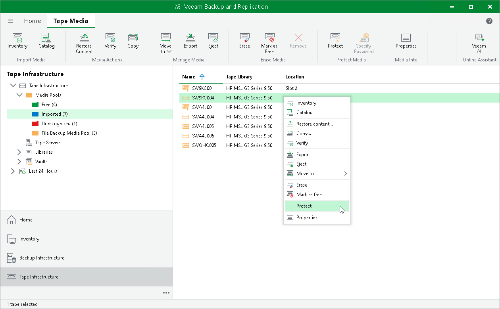

# Protecting Tapes

If you have tapes for which you need to change the retention to 'never overwrite', you can protect them. Protection option sets lifelong retention period for the selected tapes overriding the retention settings of the media pool.

You can set protection for both online or offline tapes that contain data.

|  |
| --- |
| Important |
| You can protect only tapes that contain data. You cannot protect free (empty) tapes. |

Switching On Protection

To enable protection:

1. Open the Tape Infrastructure view.
2. Navigate to the list of tapes either under the Media Pools or under the Libraries > LibraryName node > Media > Online.
3. Select tapes you want to protect and click Protect on the ribbon.

Alternatively, you can right-click selected tapes and choose Protect from the shortcut menu.

If the tape is a part of a media set, Veeam Backup & Replication will prompt you to protect the other tapes in this media set.

If the tapes are protected, they cannot be erased or marked as free by Veeam Backup & Replication or manually. To erase such tape, you need to switch the protection off first.

Switching Off Protection

You can switch off the protection at any time. The retention will return to the value set for the media pool.

