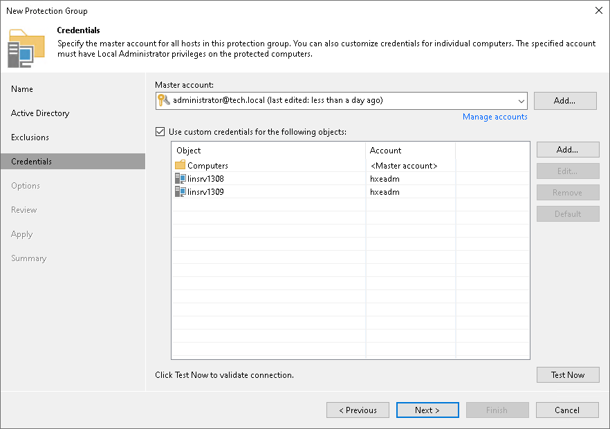

# Step 5. Specify Credentials

At this step of the wizard, specify credentials to connect to computers included in the protection group:

1. If you want to use the same credentials for all computers in the protection group, select the necessary user account from the Master account list. The account must have local administrator permissions on all computers that you have added to the protection group.

If you have not set up credentials beforehand, click the Manage accounts link or click Add on the right to add credentials. For details, see [Credentials Manager](credentials_manager.md).

As a master account, you can add only stored credentials that Veeam Backup & Replication uses for each connection to the computer with Veeam Plug-In. The user name can be specified in the following formats:

* DNS.DOMAIN.NAME\USERNAME
* USERNAME@DNS.DOMAIN.NAME

1. By default, Veeam Backup & Replication uses credentials specified in the Master account field for all computers in the protection group. If some computer requires a different user account, do the following:

1. Select the Use custom credentials for the following objects check box.
2. Click Add next to the list of objects and select the necessary object in the Add Objects window.

Objects that you have added to the protection group at the Active Directory step or the wizard are already displayed in the Use custom credentials for the following objects list. In the Add Objects window, you can also select child objects for which you want to specify custom credentials. For example, you may want to specify separate credentials for different organization units, containers, groups or individual computers within the entire domain added to the protection group.

1. In the Use custom credentials for the following objects list, select the necessary object, click Edit and select custom credentials for the object.

You can add the following types of custom credentials:

* Stored credentials. Select stored credentials if you want Veeam Backup & Replication to use the specified user name and password for each connection to the computer with Veeam Plug-In.
* Single-use credentials. Select single-use credentials if you do not want Veeam Backup & Replication to store credentials in the configuration database. With this option selected, Veeam Backup & Replication will use the specified user name and password to deploy Veeam components. After the components are successfully deployed, Veeam Backup & Replication will use Veeam Transport Service to communicate with the computer with Veeam Plug-In installed.

The user name can be specified in the following formats:

* DNS.DOMAIN.NAME\USERNAME
* USERNAME@DNS.DOMAIN.NAME

|  |
| --- |
| NOTE |
| Consider the following:   * If you configure a protection group that includes dynamic Active Directory objects, such as domain, organizational unit, container or group, the master account or custom account specified for an object must have administrator rights on all target hosts within these dynamic objects. * You cannot use a Microsoft Entra ID account to connect to computers included in the protection group. |

To check if Veeam Backup & Replication can connect to computers added to the protection group, click Test Now. Veeam Backup & Replication will form a list of computers to connect and use the specified credentials to connect to computers in the list.

