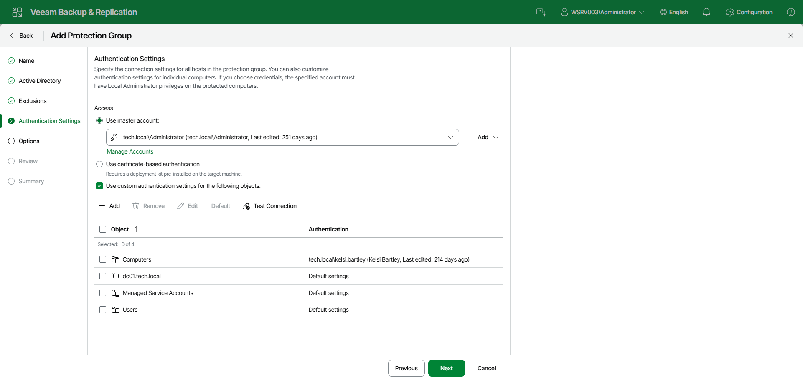

# Step 5. Specify Credentials

At the Authentication Settings step of the wizard, specify the connection settings for computers included in the protection group. You can also customize authentication settings for individual objects.

Specifying Access

In the Access section, select a method to connect to computers included in the protection group:

* Use master account. From the drop-down list, select a user account that has Local Administrator privileges on all computers that you have added to the protection group. Veeam Backup & Replication will use this account to connect to the protected computers and perform the necessary operations on them, such as uploading and installing Veeam Agent.

If you have not set up credentials beforehand, click the Manage Accounts link or click Add on the right to add credentials.

The user name can be specified in the following formats:

* DNS.DOMAIN.NAME\USERNAME
* USERNAME@DNS.DOMAIN.NAME
* HOSTNAME\USERNAME — if you use Veeam Backup & Replication on Microsoft Windows
* DOMAIN\USERNAME — if you use Veeam Backup & Replication on Microsoft Windows

* Use certificate-based authentication. Select this option if you chose to pre-install Veeam Deployer Service on the computers that you want to add to the protection group. In this case, Veeam Backup & Replication will connect to the computers using a certificate. To learn more, see [Deploying Veeam Agent Using Veeam Deployment Kit](agents_deploy_deployer.md).

Customizing Authentication Settings per Object

By default, Veeam Backup & Replication uses the connection settings specified in the Access section for all computers in the protection group. If some computer or Active Directory object requires different authentication settings, do the following:

1. Select the Use custom authentication settings for the following objects check box.

Objects that you have added to the protection group at the Active Directory step of the wizard are already displayed in the list.

1. To add a child object with its own authentication settings, click Add and select the necessary object in the Add Objects window. For example, you may want to specify separate authentication settings for different organizational units, containers, groups, or individual computers within the entire domain added to the protection group.
2. In the list, select the necessary object and click Edit to specify custom authentication settings for the object. Credentials must be specified in the following format:

* For Active Directory accounts, if you use Veeam Backup & Replication on Linux — DNS.DOMAIN.NAME\USERNAME or USERNAME@DNS.DOMAIN.NAME.
* For Active Directory accounts, if you use Veeam Backup & Replication on Microsoft Windows — DOMAIN\USERNAME, DNS.DOMAIN.NAME\USERNAME or USERNAME@DNS.DOMAIN.NAME.
* For local accounts — USERNAME or HOSTNAME\USERNAME.

1. To reset an object's authentication settings back to the master account, select the object in the list and click Default.
2. To remove an object from the list, select it and click Remove.

|  |
| --- |
| NOTE |
| Consider the following:   * If you configure a protection group that includes dynamic Active Directory objects, such as domain, organizational unit, container or group, the master account or custom account specified for an object must have administrator rights on all target hosts within these dynamic objects. * You cannot use a Microsoft Entra ID account to connect to computers included in the protection group. |

To check if Veeam Backup & Replication can connect to computers added to the protection group, click Test Connection. Veeam Backup & Replication will form a list of computers to connect and use the specified authentication settings to connect to computers in the list.

Page updated 2026-07-01

