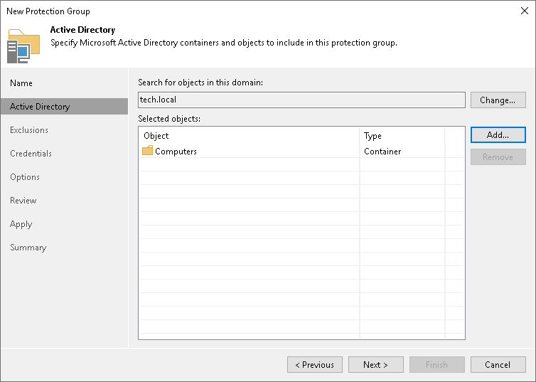

# Step 3. Specify Active Directory Objects

At the Active Directory step of the wizard, select Active Directory objects that you want to add to the protection group. You can add to a protection group the following types of Active Directory objects: domain, organizational unit, container, computer, failover cluster, or group.

To add Active Directory objects to a protection group:

1. In the Search for objects in this domain field, click Change.
2. In the Specify Domain window, specify settings of the domain whose objects you want to include in the protection group:

1. In the Domain controller or domain DNS name field, type a name of the domain controller or domain whose objects you want to include in the protection group.
2. In the Port field, specify a port number over which Veeam Backup & Replication must communicate with the domain controller. By default, Veeam Backup & Replication uses port 389.

If you want to use port 636, make sure that the domain Root CA certificate is properly published in the domain. Otherwise, Veeam Backup & Replication will not be able to establish a secure connection to the protection group.

1. From the Account list, select a user account that has read access permissions to all hosts with the required AD objects. If you have not set up credentials beforehand, click the Manage accounts link or click Add on the right to add credentials.
2. Click OK to close the Specify Domain window.

1. In the Selected objects field, click Add.
2. In the Add Objects window, select the necessary Active Directory object in the tree and click OK. You can press and hold the [Ctrl] key to select multiple objects at once.

To quickly find the necessary object, you can use the search field at the bottom of the Add Objects window.

1. Click the button to the left of the search field and select the necessary type of object to search for: Everything, Computer, Failover Cluster, Organizational Unit, Container, or Group.
2. Enter the object name or a part of it in the search field.
3. Click the Start search button on the right or press [Enter].

