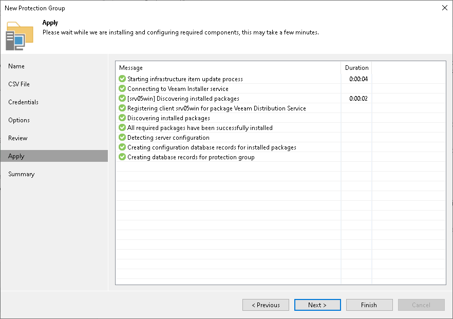

# Step 8. Assess Results

In this article

At the Apply step of the wizard, Veeam Backup & Replication will create the configured protection group. Wait for the operation to complete and click Next to continue.

Page updated 11/3/2025

Page content applies to build 13.0.1.1071
