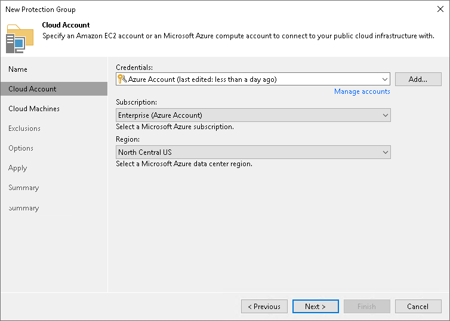

# Step 3. Specify Account

In this article

At the Cloud Account step of the wizard, specify settings for Amazon or Microsoft Azure cloud that you want to use to deploy Veeam Agents on cloud machines.

|  |
| --- |
| NOTE |
| AWS user that you use to connect to Amazon cloud must have the required permissions. To learn more, see [Permissions](agents_permissions.md#cloud_m). |

To specify settings that Veeam Backup & Replication will use to connect to the external cloud:

1. Select the account from the Credentials list. If you have not set up credentials beforehand, click the Manage accounts link or click Add on the right to add credentials using [Cloud Credentials Manager](cloud_credentials.md).

Keep in mind that to deploy Veeam Agents on cloud machines, you can specify only access keys for AWS User or Microsoft Azure Compute Account. To learn more, see [Access Keys for AWS Users](cloud_credentials_aws.md) and [Microsoft Azure Compute Accounts](restore_azure_accounts.md).

|  |
| --- |
| NOTE |
| Azure Stack Hub accounts are not supported. |

1. Specify additional information required to connect to the cloud:

For AWS User

1. From the AWS region list, select the AWS region in which Veeam Backup & Replication will deploy Veeam Agents on cloud machines.
2. From the Data center list, select the geographic region where Veeam Backup & Replication will deploy Veeam Agents on cloud machines.

For Microsoft Azure Compute Account

1. From the Subscription list, select a subscription which resources you want to use. The subscription list contains all subscriptions associated with the Azure compute or Azure Stack Hub compute accounts that you have added to Veeam Backup & Replication.

|  |
| --- |
| IMPORTANT |
| A Microsoft Azure Compute Account must be in the same subscription as the storage account specified in the settings of the Azure Blob Storage repository used as a distribution repository. For more information about the distribution repository, see [Distribution Repository](agents_infrastructure.md#repo). |

1. From the Region list, select a geographic region where you want to deploy Veeam Agents on cloud machines.

Page updated 8/7/2025

Page content applies to build 13.0.1.1071
