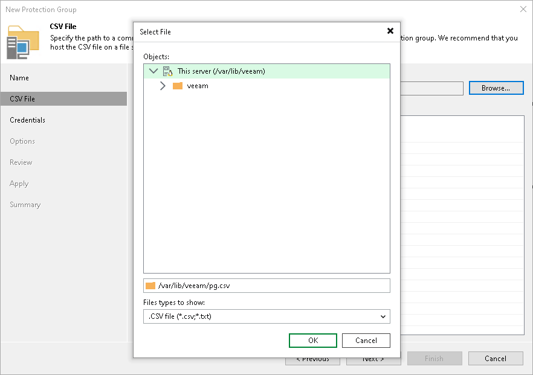
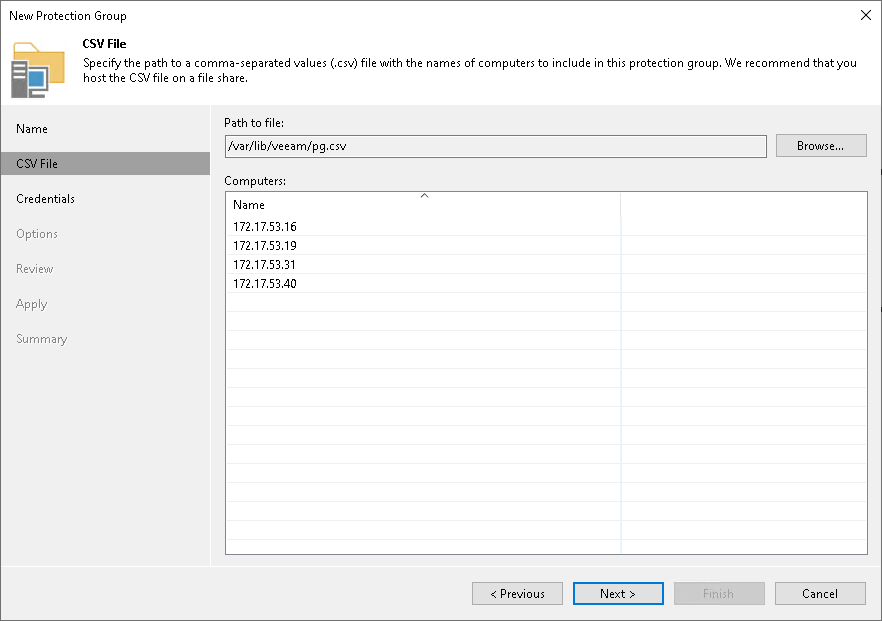

# Step 3. Specify CSV File

At the CSV File step of the wizard, specify a file that defines a list of computers that you want to add to the protection group. You must specify a list of computers in a file of the CSV or TXT format. The file must be created beforehand. To learn more, see [Preparing CSV File](#csv).

To specify a CSV file:

1. In the Path to file field, click Browse and specify a path to a CSV file that contains a list of IP addresses or domain names of computers that you want to add to the protection group:

* If you use Veeam Backup & Replication on Linux, the CSV file must reside in the /var/lib/veeam/\* directory.
* If you use Veeam Backup & Replication on Microsoft Windows, the CSV file can reside in a folder on the local drive of the Veeam backup server or in an SMB network shared folder accessible from the backup server. If the SMB network shared folder requires authentication, specify credentials to access the folder. Veeam Backup & Replication will store the credentials in its database.

1. In the Computers field, review the list of IP addresses or domain names imported from the CSV file.

|  |
| --- |
| NOTE |
| After you finish configuring the protection group, Veeam Backup & Replication will perform discovery of computers listed in the CSV file upon schedule defined in the protection group settings. If Veeam Backup & Replication is unable to read the CSV file (for example, after the file was moved or deleted from the specified location), the rescan job will use the list of computers imported from the CSV file during the previous rescan job session. |

Preparing CSV File

To define a dynamic protection scope based on a list of computers, you must create a CSV file with a list of IP addresses or domain names to scan during discovery. Veeam Backup & Replication supports IP addresses of the IPv4 and IPv6 formats.

Delimit IP addresses or domain names in the list with commas (',') or semicolons (';'). For example:

|  |
| --- |
| 172.17.53.16,172.17.53.19,172.17.53.31,172.17.53.40 |

Alternatively, you can delimit IP addresses or domain names in the list with the newline characters.

For example:

|  |
| --- |
| 172.17.53.16  172.17.53.19  172.17.53.31  172.17.53.40 |

|  |
| --- |
| IMPORTANT |
| Consider the following:   * For correct import of the CSV file, make sure to use newline characters of the CR LF type. * If the file uses a UTF encoding, it should not include a Byte Order Mark (BOM) at the beginning of the file. |

