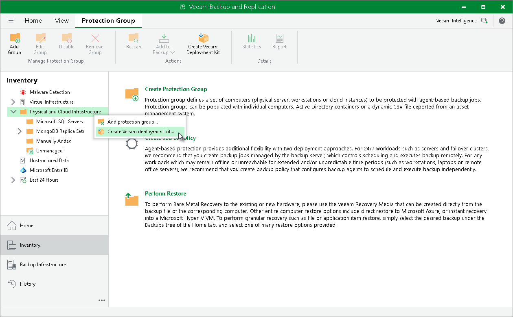

# Deploying Plug-In Using Veeam Deployment Kit

You have an option to install Veeam Plug-In on computers using certificate-based authentication instead of credentials. To do so, you must install Veeam Installer Service on the computer and then add the computer to a protection group of the [Individual computers](protection_group_types.md) type. In this case, Veeam Backup & Replication does not require SSH connection to install Veeam Plug-In.

To deploy Veeam Plug-In using Veeam Deployment Kit, perform the following steps:

1. On the Veeam Backup & Replication side, create and export Veeam Deployment Kit. You can do that in the following ways:

* Using Veeam PowerShell:

1. Start a Veeam PowerShell session. For more information, see the [Running Veeam PowerShell Sessions](https://helpcenter.veeam.com/docs/vbr/powershell/running_sessions.html?ver=13) in the Veeam PowerShell Reference.
2. Run the Generate-VBRBackupServerDeployerKit cmdlet to generate temporary certificates and installation packages that are required for installation of Veeam components. For Linux-based machines, Veeam Backup & Replication will generate certificates and packages for Veeam Deployer Service. For Microsoft Windows-based machines, Veeam Backup & Replication will generate certificates and packages for Veeam Installer Service.

To learn more, see the [Generate-VBRBackupServerDeployerKit](https://helpcenter.veeam.com/docs/vbr/powershell/generate-vbrbackupserverdeployerkit.html?ver=13) section in the Veeam PowerShell Reference.

* Using Veeam Backup & Replication console:

1. Open the Inventory view.
2. Click the Physical and Cloud Infrastructure node in the inventory pane and click Create Veeam Deployment Kit on the ribbon. Alternatively, right-click the Physical and Cloud Infrastructure node in the inventory pane and select Create Veeam deployment kit.
3. In the Create Deployment Kit window, specify a path to the folder to which Veeam Backup & Replication will export the deployment kit files.

1. Upload the exported files on the computer which database you want to protect.
2. On the computer with database side, install the uploaded files. You can do this in one of the following ways:

* Automatically, using a script provided with the installation files. To use this deployment option, navigate to the directory where you have saved the files on the computer and run one of the scripts depending on the OS running on your computer:

* for Microsoft Windows-based computer, run the InstallDeploymentKit.bat script
* for Linux-based computer, run the install-deployment-kit.sh script

|  |
| --- |
| TIP |
| You may need to modify the script according to your system configuration. |

* Manually, using a package manager:

1. Navigate to the directory where you have saved the files on the computer and install Veeam Installer Service (or Veeam Deployer Service in case of Linux-based machines) and OpenSSL packages that suit the OS running on the computer with Veeam Plug-In.
2. Run the following commands to install the certificates and restart Veeam Installer Service:

For Linux-based computer:

|  |
| --- |
| /opt/veeam/deployment/veeamdeploymentsvc --install-server-certificate server-cert.p12 |

For Microsoft Windows-based computer:

|  |
| --- |
| C:\Windows\Veeam\Backup\VeeamDeploymentSvc.exe --install-server-certificate /path/to/server-cert.pem --key /path/to/server-key.pem C:\Windows\Veeam\Backup\VeeamDeploymentSvc.exe --install-certificate /path/to/client-cert.pem Stop-Service VeeamDeploySvc -Force Start-Service VeeamDeploySvc |

1. On the Veeam Backup & Replication side, create a protection group with the following parameters:

1. At the Type step of the wizard, select Individuals computers.
2. At the Computers step of the wizard, specify a computer and select the Connect using certificate-based authentication method to connect to the computer.

To learn more, see [Specifying Computers](protection_group_scope.md).

After you create the protection group, Veeam Backup & Replication will rescan the protection group. During the rescan operation, Veeam Backup & Replication will connect to the Veeam Installer Service (or Veeam Deployer Service in case of Linux-based machines) and install Veeam Plug-Ins. To learn more, see [Rescan Job](rescan_job.md).

Related Topics

* [Protection Group Types](protection_group_types.md)
* [Creating Protection Group for Individual Computers](protection_group_create_computers.md)

