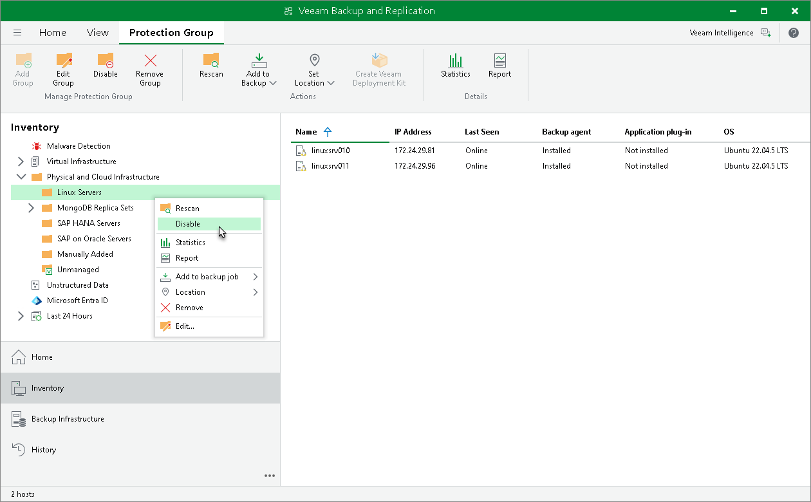

# Disabling Protection Group

You can temporary disable a protection group. When you disable a protection group, you disable scheduled discovery of protected computers added to this protection group. This may be required, for example, if a new version of Veeam Agent or Veeam Plug-In appears on the Veeam Backup & Replication server, and you do not want to deploy a new version of the product to all protected computers at once. Instead, you can disable the protection group, test the deployment process on a specific computer in this group, and then enable the protection group to let Veeam Backup & Replication deploy a new version of the product to remaining computers.

When you disable a protection group, Veeam Backup & Replication does not start the rescan job upon schedule defined in the protection group settings. However, you can start the discovery process manually. To learn more, see [Rescanning Protection Group](protection_group_rescan.md).

Disabling a protection group does not affect processing of computers included in this protection group. If a protected computer is added to an application policy, and the application policy is scheduled to start at the time when the protection group is in the disabled state, the policy will run as usual.

|  |
| --- |
| NOTE |
| You cannot disable default protection groups that act as filters used to display protected computers of a specific type: Unmanaged, Out of Date, Offline and Untrusted. |

To disable automatic discovery for the protection group:

1. Open the Inventory view.
2. In the inventory pane, expand the Physical Infrastructure node.
3. In the inventory pane, select the necessary protection group and click Disable on the ribbon or right-click the necessary protection group and select Disable.

To enable automatic discovery for the protection group:

1. Open the Inventory view.
2. In the inventory pane, expand the Physical Infrastructure node.
3. In the inventory pane, select the necessary protection group and click Enable on the ribbon or right-click the necessary protection group and select Enable.

