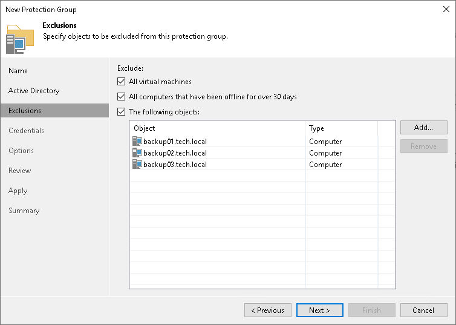

# Step 4. Exclude Objects from Protection Group

At the Exclusions step of the wizard, you can specify which objects you want to exclude from the protection group. You can exclude the following types of objects:

* All virtual machines — all VMs residing in the domain. You can select this option, for example, if you do not want to protect VMs with Veeam Agents and want to back up VM data with Veeam Backup & Replication instead.
* All computers that have been offline for over 30 days — all computers in the domain that have not logged on to Active Directory for more than 30 days.
* [Specific Active Directory objects](#ad): computers, failover clusters, groups, organizational units and containers.

Excluding Individual Active Directory Objects

To exclude Active Directory objects:

1. In the Exclude section, select the The following objects check box.
2. Click Add.
3. In the Add Objects window, select the necessary Active Directory object in the tree and click OK. You can press and hold the [Ctrl] key to select multiple objects at once.

To quickly find the necessary Active Directory object, you can use the search field at the bottom of the Add Objects window.

1. Click the button to the left of the search field and select the necessary type of object to search for: Everything, Computer, Failover cluster, Group, Organizational Unit, or Container.
2. Enter the object name or a part of it in the search field.
3. Click the Start search button on the right or press [Enter].

