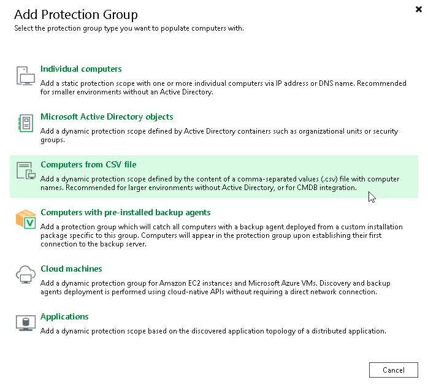

# Step 1. Launch New Protection Group Wizard

To launch the New Protection Group wizard, do the following:

1. Open the Add Protection Group window. To open the window, do one of the following:

* Open the Inventory view. Click the Physical Infrastructure node in the inventory pane and click Add Group on the ribbon.
* Open the Inventory view. Click the Physical Infrastructure node in the inventory pane and click Create Protection Group in the working area.
* Open the Inventory view. Right-click the Physical Infrastructure node in the inventory pane and select Add protection group.

1. In the Add Protection Group window, select the Computers from CSV file option.

