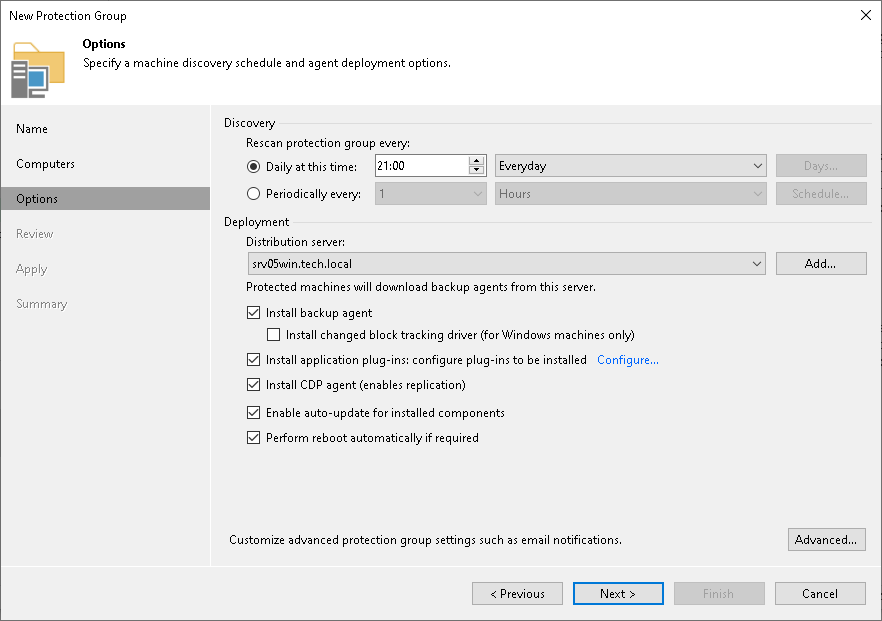

# Step 4. Specify Discovery and Deployment Options

In this article

At the Options step of the wizard, specify settings for protected computers discovery and Veeam Plug-In deployment.

Veeam Backup & Replication regularly connects to protected computers according to the schedule defined in the protection group settings. At this step of the wizard, you can define the discovery schedule and specify operations that Veeam Backup & Replication must perform on discovered computers. You can also select which server in your backup infrastructure should act as a distribution server for Veeam Plug-Ins.

|  |
| --- |
| TIP |
| Descriptions of the following controls are out of scope of the current scenario:   * Install backup agent. To learn how to use protection groups to automatically deploy Veeam Agents, see [Veeam Agent Backup](protect_comp.md). * Install CDP agent (enables replication). To learn how to use protection groups to automatically deploy Veeam CDP Agent Service and Veeam CDP Volume Filter Driver for universal continuous data protection (CDP), see [Universal CDP to VMware vSphere](universal_cdp.md). |

To specify discovery and deployment options:

1. In the Discovery section, define schedule for automatic computer discovery within the scope of the protection group:

* To run the rescan job at specific time daily, on defined week days or with specific periodicity, select Daily at this time. Use the fields on the right to configure the necessary schedule.
* To run the rescan job repeatedly throughout a day with a specific time interval, select Periodically every. In the field on the right, select the necessary time unit: Hours or Minutes. Click Schedule and use the time table to define the permitted time window for the rescan job. In the Start time within an hour field, specify the exact time when the job must start.

* To run the rescan job continuously, select the Periodically every option and choose Continuously from the list on the right. A new rescan job session will start as soon as the previous rescan job session finishes.

|  |
| --- |
| NOTE |
| You cannot create a protection group without defining schedule for automatic discovery. However, you can disable automatic discovery for a specific protection group, if needed. To learn more, see [Disabling Protection Group](protection_group_disable.md). |

1. In the Deployment section, select the object that will be responsible for the Veeam Plug-Ins distribution, select a Microsoft Windows server that you plan to use as a distribution server. Veeam Backup & Replication will use the distribution server to upload Veeam Plug-In setup files to computers added to the protection group. By default, Veeam Backup & Replication assigns the distribution server role to the backup server. To learn more, see [Distribution Server](management_infrastructure.md#distribution).
2. Clear the Install backup agent check box. Otherwise, Veeam Backup & Replication will install Veeam Agent on the machine. To learn how to use protection groups to automatically deploy Veeam Agents, see [Veeam Agent Backup](protect_comp.md).
3. If you want to instruct Veeam Backup & Replication to automatically deploy Veeam Plug-Ins on all discovered computers in the protection group, in the Deployment section, make sure that the Install application plug-ins: configure plug-ins to be installed check box is selected and click Configure. In the Application Plug-Ins window, select the check boxes next to the plug-ins that you want to install.

|  |
| --- |
| Note |
| [For Veeam Plug-In for SAP on Oracle] if you plan to use the rman\_util parameter, you must install 2 plug-ins on the Oracle server:   * Veeam Plug-In for Oracle RMAN * Veeam Plug-In for SAP on Oracle |

You can also choose to disable automated Veeam Plug-In installation. To do this, in the Application Plug-Ins window, clear the check boxes next to the plug-ins that you do not want Veeam Backup & Replication to install. In this case, you will need to install Veeam Plug-In on every computer included in the protection group and discovered by Veeam Backup & Replication. To learn more, see [Installing Plug-In](protected_computers_install.md).

1. If you want to instruct Veeam Backup & Replication to automatically upgrade Veeam Plug-Ins on discovered computers when a new version of the product appears on the distribution server, in the Deployment section, select the Enable auto-update for installed components check box.
2. Select the Perform reboot automatically if required check box to allow Veeam Backup & Replication to reboot a protected computer.
3. Click Advanced to specify advanced settings for the protection group. To learn more, see [Specify Advanced Protection Group Settings](protection_group_advanced.md).

Page updated 11/18/2025

Page content applies to build 13.0.1.1071
