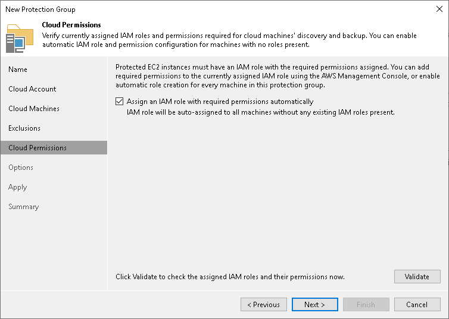

# Step 6. Specify Permissions

In this article

The Cloud Permissions step of the wizard is available if you have chosen to define a protection scope that includes Amazon EC2 virtual machines.

To communicate with Amazon EC2 virtual machines included in the protection group, you need to perform the following operations:

1. Set the IAM role with the AmazonSSMManagedInstanceCore policy. To learn more, see [this Amazon article](https://aws.amazon.com/ru/blogs/mt/applying-managed-instance-policy-best-practices/).
2. Assign the IAM role to the cloud machine you want to back up.

Veeam Backup & Replication allows you to automate these operations.

At this step of the wizard, set roles for Amazon EC2 virtual machines included in the protection group:

1. If you want to instruct Veeam Backup & Replication to automatically set the required role and policy, select the Assign an IAM role with required permissions automatically check box. If necessary, Veeam Backup & Replication will set the IAM role with the AmazonSSMManagedInstanceCore policy to all virtual machines included in the protection group.

Keep in mind that Veeam Backup & Replication will set the IAM role with the AmazonSSMManagedInstanceCore policy to the virtual machine only if the following conditions are met:

* The user account specified at the Cloud Account step of the wizard has enough access rights to set the IAM role.

* The virtual machine does not have the IAM role already assigned.

1. To check if Veeam Backup & Replication can communicate with virtual machines added to the protection group, click Validate. Veeam Backup & Replication will try to connect to all virtual machines included in the protection group.

Page updated 8/21/2024

Page content applies to build 13.0.1.1071
