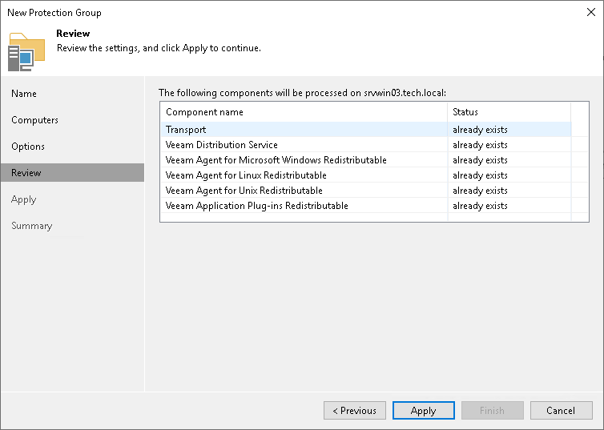

# Step 6. Review Components

At the Review step of the wizard, review what Veeam Backup & Replication components are already installed on the distribution server specified for the protection group and what components will be installed.

1. Review the components.
2. Click Apply to add the configured protection group to the inventory.

|  |
| --- |
| Note |
| Veeam Plug-In and Veeam Agent components are installed on the distribution server even if the Install application plug-ins and Install backup agent check boxes are clear at the [Options](protection_group_options.md) step of the wizard. |

