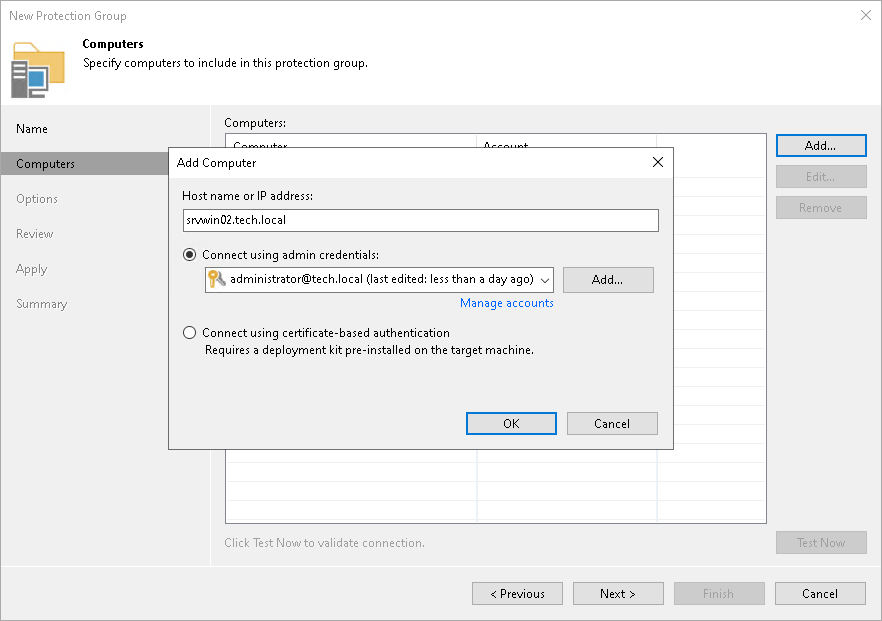

# Step 3. Specifying Individual Computers

At this step of the wizard, specify computers that you want to add to the protection group.

To add a computer to a protection group:

1. Click Add.
2. In the Add Computer window, in the Host name or IP address field, enter a full DNS name, NetBIOS name or IP address of the computer that you want to add to the protection group.
3. Select a method to connect to the computer:

* Connect using admin credentials. In this case, from the Credentials list, select a user account that has administrative permissions on the computer that you want to add to the protection group. Veeam Backup & Replication will use this account to connect to the protected computer and perform the necessary operations on the computer: upload and deploy Veeam Plug-In, and so on.

If you have not set up credentials beforehand, click the Manage accounts link or click Add on the right to add credentials.

Veeam Backup & Replication allows you to add the following types of credentials:

* Stored credentials. Select stored credentials if you want Veeam Backup & Replication to use the specified user name and password for each connection to computer with Veeam Plug-In.

* Single-use credentials. Select single-use credentials if you do not want Veeam Backup & Replication to store credentials in the configuration database. With this option selected, Veeam Backup & Replication will use the specified user name and password only for the first connection to Veeam Agent. After that, Veeam Backup & Replication will use Veeam Transport Service to communicate with the computer.

Keep in mind that the username must be specified in the [down-level logon name](https://docs.microsoft.com/en-us/windows/win32/secauthn/user-name-formats#down-level-logon-name) format. For example, DOMAIN\UserName or HOSTNAME\UserName. Use the full domain or hostname name. Do not replace them with a dot.

For details, see [Credentials Manager](credentials_manager.md).

* Connect using certificate-based authentication. Select this option, if you chose to pre-install Veeam Installer Service on the computer you want to add to the protection group. In this case, Veeam Backup & Replication will communicate with the computer using a certificate. With Veeam Installer Service, Veeam Backup & Replication will install Transport Service that will be used to perform the necessary operations on the computer: upload and install Veeam Plug-In. To learn more, see [Deploying Plug-In Using Veeam Deployment Kit](protection_group_deployer_service.md).

1. Repeat steps 1–3 for every computer that you want to add to the protection group.
2. To check if Veeam Backup & Replication can communicate with computers added to the protection group, click Test Now. Veeam Backup & Replication will use the specified credentials to connect to all computers in the list.

|  |
| --- |
| NOTE |
| If you chose to manually add Linux-based computers to the list of trusted hosts in Veeam Backup & Replication, when you test credentials for an unknown Linux-based computer in the protection group settings, the test operation will complete with the Failed status. This happens because Veeam Backup & Replication cannot connect to the untrusted computer before you add this computer to the list of trusted hosts. To learn more, see [Adding Computers to Trusted Hosts List](security_settings_ssh_trust.md). |

