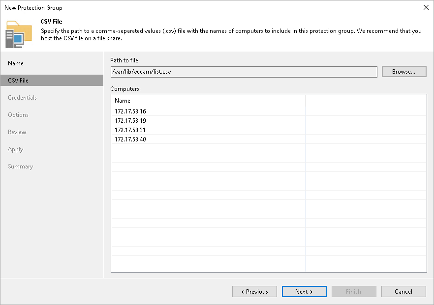

# Step 3. Specifying CSV File

At this step of the wizard, specify a file that defines a list of computers that you want to add to the protection group. You must specify a list of computers in a file of the CSV or TXT format. The file must be created beforehand. To learn more, see [Preparing CSV File](#csv).

To specify a CSV file:

1. In the Path to file field, click Browse and specify a path to a CSV file that contains a list of IP addresses or domain names of computers that you want to add to the protection group.

Required location of a CSV file depends on the OS running on the Veeam backup server:

* If you use Linux-based backup server, the CSV file must reside in the /var/lib/veeam/\* directory.
* If you use Microsoft Windows-based backup server, the CSV file can reside in any folder on the local drive of the Veeam backup server or in a network shared folder accessible from the backup server.

1. In the Computers field, review the list of IP addresses or domain names imported from the CSV file.

|  |
| --- |
| NOTE |
| After you finish configuring the protection group, Veeam Backup & Replication will perform discovery of computers listed in the CSV file upon schedule defined in the protection group settings. If Veeam Backup & Replication is unable to read the CSV file (for example, after the file was moved or deleted from the specified location), the rescan job will use the list of computers imported from the CSV file during the previous rescan job session. |

Preparing CSV File

To define a dynamic protection scope based on a list of computers, you must create a CSV file with a list of IP addresses or domain names to scan during discovery. Veeam Backup & Replication supports IP addresses of IPv4 and IPv6 formats.

Delimit IP addresses or domain names in the list with commas (',') or semicolons (';'). For example:

|  |
| --- |
| 172.17.53.16,172.17.53.19,172.17.53.31,172.17.53.40 |

Alternatively, you can delimit IP addresses or domain names in the list with the newline character:

|  |
| --- |
| 172.17.53.16 |

